# Day 1 - Controlling the player

So before we start a day: please look at the prerequisites and make sure you are familiar with all the links referred to.

## Prerequisites

I started learning godot 4.1.1 yesterday.

What I did first is make the example 2D game there, after carefully reading up on the key concepts:

- [Key concepts](https://docs.godotengine.org/en/stable/getting_started/introduction/key_concepts_overview.html)
- [Step by Step](https://docs.godotengine.org/en/stable/getting_started/step_by_step/index.html)
- [Your first 2D game](https://docs.godotengine.org/en/stable/getting_started/first_2d_game/index.html)

In case you, like me, are working in windows and have 2 old monitors connected via laptop docking station: my godot engine crashed while moving it to an external monitor. 

Apparently, it's a [known issue](https://github.com/godotengine/godot/issues/44778) also [here](https://github.com/godotengine/godot/issues/28785).

## A new project

Let's start a new project. 

Because Zelia once started out as an HTML5 webgame it might work well in the web again. Also I want to be able to compile to as many platforms as possible this time, so let's pick the `Compatibility` renderer:

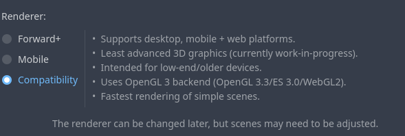

## Importing the player assets

Because Zelia has become a pretty big project we should pay attention to directory structure early on.

Let's make a subdir in the root folder named `player` with another subdir named `images`.

You can download her png files from [assets/zelia-player.zip](https://github.com/Teaching-myself-Godot/rewriting-zelia-tutorial/raw/main/assets/zelia-player.zip)

Your FileSystem tab should now look like this:

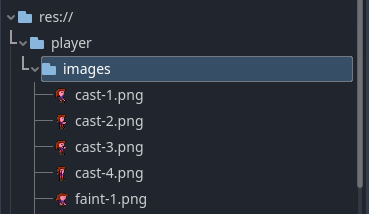

Zelia also has a jump sound. Let's create a sounds dir for it.
Here is her [jump-sound.wav](https://github.com/Teaching-myself-Godot/rewriting-zelia-tutorial/raw/main/assets/jump-sound.wav):

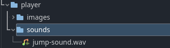


## Player Node setup

For this bit we'll be guided by the instructions in [Your first 2D game](https://docs.godotengine.org/en/stable/getting_started/first_2d_game/02.player_scene.html). 

If you're missing details on how to execute the next steps, please refer to it.

1. Add an `Area2D` node and rename it to `Player`.
2. Save the `player.tscn` file in `res://player/player.tscn`
3. Make `Player`'s [child nodes not selectable](https://docs.godotengine.org/en/stable/_images/lock_children.webp)
4. Add an `AnimatedSprite2D` child node with a `SpriteFrames` resource
5. Click `SpriteFrames` again to open the `Animations` panel. 

### Setting up the animations

We need the following animation names in the list:
- casting
- dying
- forward
- idle
- jumping
- running

The asset files you downloaded give a good filename hint as to where they belong, but I will list them for you anyway.

Add the images like so:

- casting: `cast-1.png` up to `cast-4.png`
- dying: `faint-1` up to `faint-8.png`
- forward: `forward.png`
- idle:  `stand-1.png`
- jumping: `jump.png`
- running: `run-1.png` up to `run-5.png` _AND_ `run-4.png` down to `run-2.png`

### Higher framerate

When testing the animation for running I noticed that it did not look as smooth as I was used to. Matching the original game let's change the framerate from 5 to 15 for `dying` and `running`:

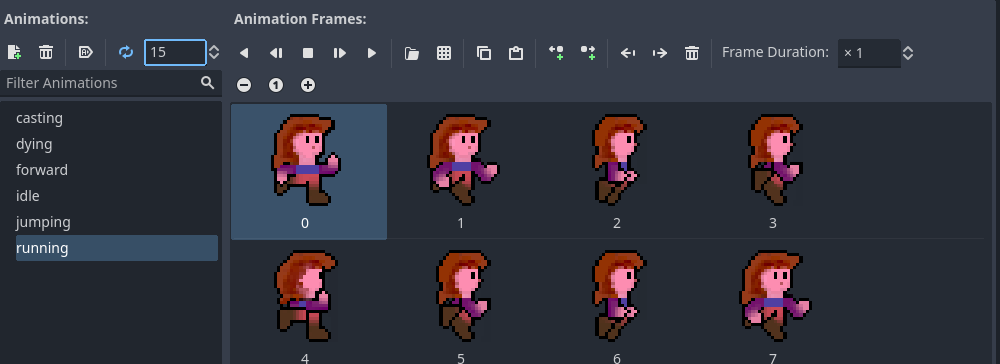


### Technical debt 1

In the original game `casting` was not - strictly speaking - an animation, but a set of casting orientations based on an angle. We will probably have to fix that later.


### Add a hitbox

So the original Zelia had pixel perfect collisions. I wrote everything myself, so it was quite a battery hog in modern machines and a performance killer in older machines. However, I mainly did that to avoid having to draw hitboxes and doing polygon based collision math myself.

_If_ we want pixel perfect collision again, we'd probably follow this recipe on [stackoverflow](https://stackoverflow.com/questions/68063306/how-do-you-do-pixel-perfect-collisions-in-godot-engine#answer-74856202). For now, let's make do with a nice pill shape just like in the [guide](https://docs.godotengine.org/en/stable/getting_started/first_2d_game/02.player_scene.html).

1. Create another child node for `Player` of the type `CollisionShape2D`.
2. Choose `CapsuleShape2D` in the inspector tab next to Shape
3. 'Ungroup' the children of `Player` to make the `CollisionShape2D` selectable
4. Align the box like in the screenshot below 
5. And 'group' them again.

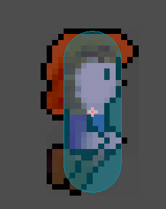

Save everything and test the current scene with F6 (make sure Zelia's in the viewport).

## Setting up the screen

Zelia looks so small!

That makes perfect sense because she's only about 30 pixels tall. The original game resolution was fullscreen and matched the aspect ratio of your active monitor to make the game `320px` wide. 

After stumbling my own way through the settings, I looked up this guide on [resolutions](https://docs.godotengine.org/en/stable/tutorials/rendering/multiple_resolutions.html).

Although I would have preferred the outcome to look like this:

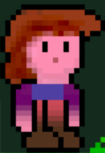

What I managed to achieve in godot by myself was blurry.

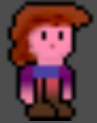

However, this [reddit thread](https://www.reddit.com/r/godot/comments/v5blkk/blurry_sprite_godot_40/) came to the rescue to help me end up with this:

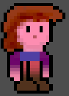


### The final resizable window setup I'm happy with

1. Open `Project > Project Settings`
2. Go to `Display > Window`
3. Set `Viewport Width` to `320`
4. And `Viewport Height` to `180`
5. Make sure `Mode` is set to `Windowed`
6. And that `Resizable` is checked to `On`
7. Set the `Stretch` mode to `canvas_items`
8. And the `Aspect` to `keep`
9. Then open `Render > Textures > Canvas Textures`
10. And change `Filter` to `Nearest`


## Adding controls

The original game was written for a gamepad and tested with this (tr|d)usty controller:

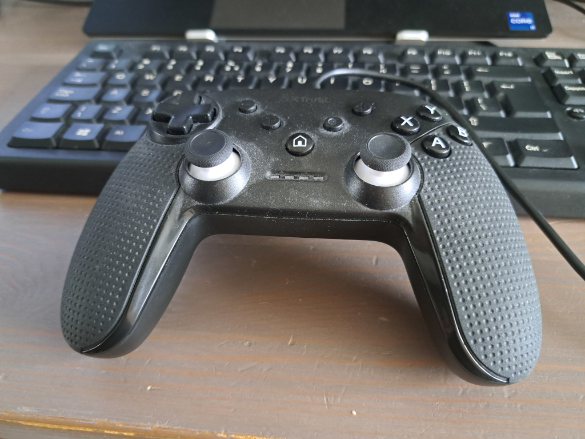

Keyboard and mouse were added later and work quite differently.

So let's first create some dedicated inputs for running and jumping and see if we can fix the casting+aiming mechanic later.

### Input Map

Open `Project > Project Settings > Input Map`.

Add these new `Actions`:

1. Run right 
2. Run left
3. Jump

Assign these keys to `Run right`:

1. Keyboard 'D' - `D (Physical)`
2. Keyboard Right arrow - `Right (Physical)`
3. Joypad Axis 0 (`Left Stick Right`, `Joystick 0 Right - All Devices`)
4. Joypad Button 14 (`D-pad Right - All Devices`)


Assign these keys to `Run left`:

1. Keyboard 'A' - `A (Physical)`
2. Keyboard Left arrow - `Left (Physical)`
3. Joypad Axis 0 (`Left Stick Left`, `Joystick 0 Left - All Devices`)
4. Joypad Button 13 (`D-pad Left - All Devices`)

And assign these keys to `Jump`:

1. Keyboard 'W' - `W (Physical)`
2. Keyboard Up arrow - `Up (Physical)`
3. Joypad Button 0 - (`Buttom Action`, `Sony Cross`, `Xbox A`, `Ninendo B`)

## Player script

Finally, let's code some stuff, taking guidance  from [the official guide](https://docs.godotengine.org/en/stable/getting_started/first_2d_game/03.coding_the_player.html).

Attach a script to the `Player`-node and save it in `res://player/player.gd`

So in the original game there were some movement states I would like to keep using to make our rewrite easier:

```python
from enum import Enum

class Orientation(Enum):
    LEFT = 1
    RIGHT = 2
    NONE = 3
    UP = 4
    DOWN = 5

class MovementState(Enum):
    IDLE = 1
    RUNNING = 2
    AIRBORNE = 3
    JUMPING = 4
    DYING = 5
    CASTING = 6
    FACING_FORWARD = 7
    HOLDING_ITEM = 8

class CastDirection(Enum):
    DIAG_DOWN = 1
    FORWARD = 2
    DIAG_UP = 3
    UP = 4
    DOWN = 5
```

Let's [read up on](https://docs.godotengine.org/en/stable/tutorials/scripting/gdscript/gdscript_basics.html) how to port these python style `enums` to gdscript.

That looks nice and clean, let's define some inside our `player.gd` script for now.

Let's assign them to some properties in the `_ready()` func.

```gdscript
extends Area2D

enum Orientation   { LEFT, RIGHT }
enum MovementState { IDLE, RUNNING, AIRBORNE }

# We will want to debug these states, let's export them as well
@export var movement_state : int
@export var orientation    : int


func _ready():
	movement_state = MovementState.IDLE
	orientation    = Orientation.RIGHT

func _process(delta):
	pass

```

### Test run

Run the current scene to test our property assignments. 

To debug exported properties while running, go to the node tree window and pick `Remote` in stead of `Local`:

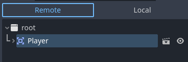

Then click the `root`-node first and then the `Player`-node. 

The `Inspector` tab for `Player` should now show:

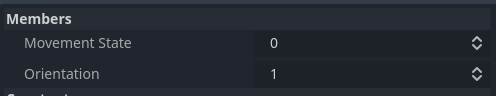

You can even change the property values through this interface!

## Implement running animations

So let's now write some body for the `_process()` func.

Let's first write tests for the `Run right` and `Run left` actions to set the movement

```gdscript
func _process(delta):
	if Input.is_action_pressed("Run right"):
		orientation    = Orientation.RIGHT
		movement_state = MovementState.RUNNING
	elif Input.is_action_pressed("Run left"):
		orientation    = Orientation.LEFT
		movement_state = MovementState.RUNNING
	else:
		movement_state = MovementState.IDLE
```

To test out whether our state changes work we run the current scene and open the `Remote` inspector for player. (Remember: click the `root`-node first and then the `Player`-node).

I noticed a slight delay in the inspector, but I'm guessing that's due to it being on a lower priority thread.

### Picking the right animations based on states

Let's reread [the guide](https://docs.godotengine.org/en/stable/getting_started/first_2d_game/03.coding_the_player.html#choosing-animations) on changing the animations.

Add the following code at the bottom of the `_process` func:
```gdscript
	match (movement_state):
		MovementState.RUNNING:
			$AnimatedSprite2D.animation = "running"
		_: # MovementState.IDLE
			$AnimatedSprite2D.animation = "idle"

	if orientation == Orientation.LEFT:
		$AnimatedSprite2D.flip_h = true
	else:
		$AnimatedSprite2D.flip_h = false
```

And make sure our `AnimatedSprite2D` node starts playing in func `_ready`.

```gdscript
func _ready():
	movement_state = MovementState.IDLE
	orientation    = Orientation.RIGHT
	$AnimatedSprite2D.play()
```

Test the current scene and if all is well our little Zelia is up and running! (pun intended)

## Implementing the jump

Ok so now we want her to jump!

This is harder than it seems. It's not just a matter of `if jump-is-pressed then draw jump`: we are missing some environmental factors.

Let's first define what we know about how jumping works.

1. Test if the jump button was just pressed  `Input.is_action_just_pressed("Jump")`
2. `Player` receives some negative y-acceleration
3. `Player` spends some time in the air (i.e. is not touching a floor)
4. Gravity (some positive y-acceleration) pulls the player back down.

Seems like it would be a smart move to change the `Player`-node into a [`RigidBody2D`](https://docs.godotengine.org/en/stable/classes/class_rigidbody2d.html) at some stage.

However, for now we just want to have some direct feedback from our inputs so let's mock some air time:

### Mock airtime node

Create a new `Timer` node as a child node for `Player` and call it `MockAirTimer` ... or if you're deadset on it `MockAirborneTimeTimer`. :-)

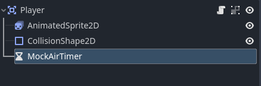

Let the `Wait Time` property remain at `1s` and mark it as `One Shot`.

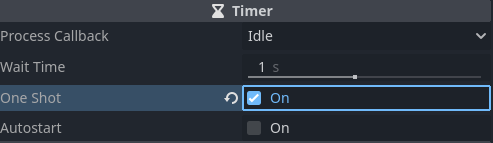

### Starting the MockAirTimer when the jump button was pressed

Change the `_process` func to match this snippet; changes and additions are under the comments.

```gdscript
func _process(delta):
	# If user wants to jump, start the MockAirTimer and change the movement state to airborne
	if Input.is_action_just_pressed("Jump") and movement_state != MovementState.AIRBORNE:
		$MockAirTimer.start()
		movement_state = MovementState.AIRBORNE

	if Input.is_action_pressed("Run right"):
		orientation    = Orientation.RIGHT
		# Only change movement state to running if not airborne
		movement_state = MovementState.RUNNING if movement_state != MovementState.AIRBORNE else MovementState.AIRBORNE
	elif Input.is_action_pressed("Run left"):
		orientation    = Orientation.LEFT
		# Only change movement state to running if not airborne
		movement_state = MovementState.RUNNING if movement_state != MovementState.AIRBORNE else MovementState.AIRBORNE
	else:
		# Only change movement state to idle if not airborne
		movement_state = MovementState.IDLE    if movement_state != MovementState.AIRBORNE else MovementState.AIRBORNE

	match (movement_state):
		MovementState.RUNNING:
			$AnimatedSprite2D.animation = "running"
		# This was added
		MovementState.AIRBORNE:
			$AnimatedSprite2D.animation = "jumping"
		_: # MovementState.IDLE
			$AnimatedSprite2D.animation = "idle"

	if orientation == Orientation.LEFT:
		$AnimatedSprite2D.flip_h = true
	else:
		$AnimatedSprite2D.flip_h = false
```

### Listening to the MockAirTimer timeout

If we let her jump now she will remain airborne forever. Let's not forget to add a listener to the `MockAirTimer`.

Select the `MockAirTimer`-node in the node tree view and open the `Node` tab next to the `Inspector` tab.

Double-click `timeout()` to open the `Connect a Signal` dialog:

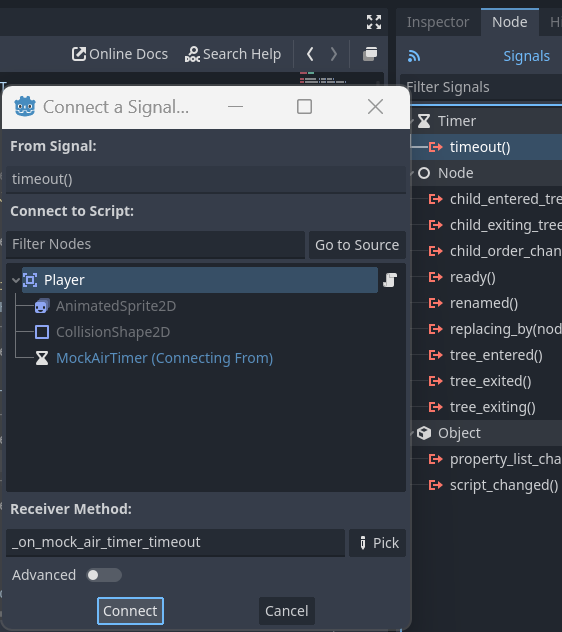

Leave all the defaults in place and click `Connect`

### Handle the timeout

We now end up with the listener func `_on_mock_air_timer_timeout` to implement like this:

```gdscript
func _on_mock_air_timer_timeout():
	movement_state = MovementState.IDLE
```

Run the player scene to test out the jump. 

### Tweaking the timings

Personally I think one second of air time is a little to long, so let's change it to  `0.7s` - not too long as to seem unnatural, yet long enough for her to change direction in the air.

## Jump sound

Before we round up let's also add in the jump sound. Create a new child node for `Player` of type `AudioStreamPlayer` and call it `JumpSound`.

Open up the `Inspector` and next to `Stream` use `Quick load` and pick `jump-sound.wav` from our resources dir.

Then add this new line of code in `_process`:

```gdscript
	if Input.is_action_just_pressed("Jump") and movement_state != MovementState.AIRBORNE:
		$JumpSound.play() # the new line
```

## Technical debt 2

The [code is starting to look a little messy](https://github.com/Teaching-myself-Godot/godot-zelia/blob/6d300048f64f709ae48f67c5de0fc57542551f6e/player/player.gd) already, so we might want refactor at this point.

No worries, we'll revisit this code often.

## Wrap up

Well that wraps up our day. 

I hope you enjoyed it as much as I did!

Our next day will introduce some tiles and some movement. 

Maybe we can even try out the [`RigidBody2D`](https://docs.godotengine.org/en/stable/classes/class_rigidbody2d.html) at some stage!

