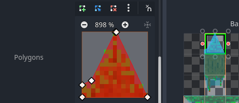
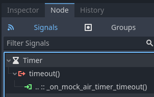

# Day 2 - Adding some tiles and some physics

So today we're going to achieve these goals:

1. Zelia will become subject to the laws of physics
2. She will move right and left by running
3. She will jump
4. A camera will follow her around

But before we can do that, we need some surfaces for her to run around on.

## Learning goals

Before I could make this day's tutorial I had to read up on and watch:

1. [Using TileMaps](https://docs.godotengine.org/en/stable/tutorials/2d/using_tilemaps.html)
2. [Terrain Autotiling and Alternative Tiles ~ Godot 4 Tutorial for Beginners](https://www.youtube.com/watch?v=vV8uKN1VnN4)
3. ~~[`RigidBody2D`](https://docs.godotengine.org/en/stable/classes/class_rigidbody2d.html)~~
4. [CharacterBody2D platformer movement](https://docs.godotengine.org/en/stable/tutorials/physics/using_character_body_2d.html#platformer-movement)

If you lost your project or want to start from here, I tagged the project after day one so you could clone or download it from [github](https://github.com/Teaching-myself-Godot/godot-zelia/tree/after-day-1)

## Addings Tiles in a `TileMap`

First make sure you have some surface assets ready. Create a new resource dir called `surface_maps` and put the contents of this [`zip`](https://github.com/Teaching-myself-Godot/rewriting-zelia-tutorial/raw/main/assets/surface_maps.zip) in it, including subdirs:


### Create the `Tilemap`

Go `Scene > New Scene` and create new scene of type `TileMap`. Then rename it to `World` by double clicking on its node.

Let's follow the steps in [Using TileMaps](https://docs.godotengine.org/en/stable/tutorials/2d/using_tilemaps.html) and the [video](https://www.youtube.com/watch?v=vV8uKN1VnN4).

From the `Inpector` do:

1. Set the `Cell Quadrant` property to `15`
2. Create a new `TileSet` 
3. Set the `x` and `y` of the `Tile Size` property to `15px`
4. Create a `Physics Layer`
5. Create a `Terrain Set`
6. Set the `Mode` property to `Match Sides`
7. Add a `Terrain` and give it a bright green color
8. Set the `Name` property to `Grass and Dirt`

It should look like this now:


### Making an `Atlas` of an image

Next open the `Tileset` pane on the bottom and add an `Atlas` using the `+`-button.

1. Set the `Texture` property for this `Atlas` by loading the resource `res://surface_maps/grass-and-dirt/1.png`. 
2. Pick `Yes` when offered to automatically detect tiles:
3. Set the `Name` property to `grass-and-dirt`


### Add the `Terrain` and `Physics Layer` to the tiles

1. Now choose the `select` tab 
2. select all the tiles.
3. Pop open `> Terrains`.
4. Set `Terrain Set` to `0` (the number found by hovering over the `Inspector > World > Terrain Sets` property)
5. Set `Terrain` to `0`  (the number found by hovering over the `Inspector > World > Terrain Sets > Terrains` property)
6. Pop open `Physics > Physics Layer 0` (we just created that)

### Give the tiles their collision area

To Set up the collision area of a tile you can select one at a time and press the `F`-key. 

This will make a square you can change into another type of polygon (we'll do that later):


Apply this to all 15 tiles.

### Set the `Terrains Peering Bit` for each tile

You can paint this! (it's in the [video](https://www.youtube.com/watch?v=vV8uKN1VnN4)).

1. Go to the `Paint` tab.
2. Select a property editor: Terrains
3. Pick `Terrain Set 0` for `Terrain Set`
4. Pick `Grass and Dirt` for `Terrain`
5. Now paint over the tiles so they look like this:


### We need one `Alternative Tile`

There is one type of tile missing, the one that has neighbors on all four sides. 

We can achieve this by making an `Alternative Tile`.

1. Go to `Select`
2. Select the tile that is all dirt (x = 15 and y = 15)
3. Right click on it
4. Choose `Create an Alternative Tile`
5. Press `F` to give it a collision rect
6. Go back to `Paint`
7. Click on the new tile 
8. Paint it to neighbour all sides:


### Paint some terrain

If we did _all_ this correctly, now we should be able to paint some Tiles on the viewport.

1. Choose `TileMap` on the bottom of the `Tiles` tab
2. Choose the `Terrains` tab
3. Pick `Terrain Set 0 > Grass and Dirt`
4. Choose the `Rectangles` draw mode
5. Drag a rectangular area in the `World`-scene viewport.

All this work should allow you to draw these shapes into the viewport in no time:


### Don't forget to save!

I almost forgot myself. Press `Ctrl-S` to save the `World`-scene into `rest://world.tscn`

### Technical debt 3

After reading up about `TileMap` - including developers' opinions about it, I concluded that at this point I can safe create one `TileMap`-scene, call it `World`, and assume we will be making all the level content in it.

This violates some of the [SOLID](https://en.wikipedia.org/wiki/SOLID) principles, i.e. it does not separate the concern of tiles from the concern of a map/level/world, but we will accept this potential technical debt.

## Import some more `Atlases`

If you carefully follow the same recipe you can of course create more `Terrains` for `Terrain Set 0` this way.

Just one screenshot hint for the one I added `res://surface_maps/tree-trunk/1.png`. It's about adjusting the collision area by manipulating the initial rectangle after pressing `F`:




## Add the `Player` to the `World` scene

Let's add the `Player`-node as an instance into this `World`-scene.

Just drag her scene file from the `FileSystem` tab into the `tree view`: `res://player/player.tscn`, like in the first tutorials.

Test the current scene.

Actually make the `World`-scene the main scene by right clicking on `world.tscn` in the `FileSystem` tab and picking `Set as Main Scene`.

Use `F5` or your OS's shortcut to run the entire project.

There is a lot missing, we can't leave Zelia just _hanging_ there! (ha ha ha).


### Make her subject to the laws of physics.

Like we speculated during day 1, we need to change her `Node Type` if we do not want to write all the physics ourselves. 

And I don't. I did it last time and it took me weeks and weeks of tweaking; and there are sure to still be bugs hanging around.

### First attempt with `RigidBody2D`

In my first attempt I actually tried to make `Player` extend from `RigidBody2D` and failed to get a good enough grip on what was happening. 

You can check out the result on [the day-2-epic-fail tag of the github project](https://github.com/Teaching-myself-Godot/godot-zelia/blob/day-2-epic-fail/player/player.gd) of the code...


### Second attempt with `CharacterBody2D`

For my second attempt I read up on [CharacterBody2D platformer movement](https://docs.godotengine.org/en/stable/tutorials/physics/using_character_body_2d.html#platformer-movement). Let's try that out now.


1. Go to the `Player` scene view (the one where she is the root node).
2. Right click on `Player` 
3. Pick `Change type`
4. Choose `CharacterBody2D`
5. Edit `res://player/player.gd` and change the extends line:

```gdscript
extends CharacterBody2D # this first line changed!
```

Test by running the project. That changed nothing (for now).

## Adapting her script to `CharacterBody2D`

So let's try this out: [CharacterBody2D platformer movement](https://docs.godotengine.org/en/stable/tutorials/physics/using_character_body_2d.html#platformer-movement).

Much has change, feel free to copy/paste this first and see if it works, but you probably know the most imporant law of cheating with `Stackoverflow`: type it out yourself to learn better.

```gdscript
extends CharacterBody2D

enum Orientation   { LEFT, RIGHT }
enum MovementState { IDLE, RUNNING, AIRBORNE }

# I removed the exports for now, no debugging needed at the moment
var movement_state : int
var orientation    : int

# Get the gravity from the project settings so you can sync with rigid body nodes.
# NOTE: I changed the default from 980 to 1300, Zelia jumps high yet falls fast.
var gravity    = ProjectSettings.get_setting("physics/2d/default_gravity")
# The most realistic speed for Zelia's feet
var speed      = 120.0
# Funnily the original game had jump_speed set to -4.0 and gravity to 13.0
var jump_speed = -400.0

# No changes here
func _ready():
	movement_state = MovementState.IDLE
	orientation    = Orientation.RIGHT
	$AnimatedSprite2D.play()

# Changed _process to _physics_process
func _physics_process(delta):
	# Apply the gravity.
	velocity.y += gravity * delta

	# Update the MovementState based on the collisions observed
	if movement_state == MovementState.AIRBORNE:
		# If she's airborne right now
		if is_on_floor():
			# .. and hits the floor, she's idle
			movement_state = MovementState.IDLE
		elif Input.is_action_pressed("Run right"):
			# Else you can still move her right
			orientation = Orientation.RIGHT
			velocity.x = speed
		elif Input.is_action_pressed("Run left"):
			# ... and left
			orientation = Orientation.LEFT
			velocity.x = -speed
		else:
			velocity.x = 0
	else:
		# Else we are not airborne right now
		if Input.is_action_pressed("Run right"):
			# so we run right when run right is pressed
			orientation = Orientation.RIGHT
			movement_state = MovementState.RUNNING
			velocity.x = speed
		elif Input.is_action_pressed("Run left"):
			# .. and left ...
			orientation = Orientation.LEFT
			movement_state = MovementState.RUNNING
			velocity.x = -speed
		else:
			# and stand idle if no x-movement button is pressed
			velocity.x = 0
			movement_state = MovementState.IDLE  

	# Handle Jump, only when on the floor
	if Input.is_action_just_pressed("Jump") and is_on_floor():
		$JumpSound.play()
		movement_state = MovementState.AIRBORNE
		velocity.y = jump_speed
	
	# This code has not changed
	match (movement_state):
		MovementState.RUNNING:
			$AnimatedSprite2D.animation = "running"
		# This was added
		MovementState.AIRBORNE:
			$AnimatedSprite2D.animation = "jumping"
		_: # MovementState.IDLE
			$AnimatedSprite2D.animation = "idle"

	# Neither has this
	if orientation == Orientation.LEFT:
		$AnimatedSprite2D.flip_h = true
	else:
		$AnimatedSprite2D.flip_h = false

	# Yet this is new
	move_and_slide()
```

And it just works! Frankly: it's much better than the original.

If you are as new to Godot and perfab 2D physics engines as I am, make sure you read the tutorial and the docs carefully and try to write the script yourself:

- [CharacterBody2D platformer movement](https://docs.godotengine.org/en/stable/tutorials/physics/using_character_body_2d.html#platformer-movement)
- [CharacterBody2D class reference](https://docs.godotengine.org/en/stable/classes/class_characterbody2d.html)

### Change the gravity setting

As I my mentioned in the code comments, I changed the Project's default gravity setting from `980` to `1300`:

1. Go to `Project > Project Settings `
2. Click on `Filter Settings`
3. Type in `gravity`
4. Pick `Physics > 2D`
5. Set `Default Gravity` to `1300`


### Make it scroll with `Camera2D`

The original Zelia never ever left the center of the screen; everything _else_ just moved. 

I read _somewhere_ that it would be easy: just add a `Camera2D` child node to the `Player`-node.

This evening my son asked me for a demo, so I proposed to him we check it out.. He was amazed: "De dingen waarvan je verwacht dat ze kort duren om te maken duren gewoon kort om te maken!" (That is Dutch for: "The things you'd expect a short time to make actually take a short time to make!").

1. Right click the `Player`-node
2. Click `Add Child Node`
3. Pick `Camera2D`
4. Start the game

Voilá.

## Dead code Code cleanup 

We left some dead code. Let's fix that before wrapping up our day.

In our new script we to away the need for our `MockAirTimer`. 

So let's remove it.

### Removing the `_on_mock_air_timer_timeout` signal

Just to be sure, let's disconnect the `signal` we made first:

1. Select the `MockerAirTimer` node in the treeview of the `Player` scene
2. Click the `Node` tab next to `Inspector`
3. Right click `.. ::_on_mock_air_timer_timeout()`
4. Choose `Disconnect`



### Remove `MockAirTimer` itself

Right click on the `MockAirTimer`-node in the tree view and delete it.

Make sure all references to it in `player.gd` are gone as well, or you'll get a reference error.

## Technical debt 4

We have some poorly chosen names. 

I am we can do better than `"Run Right"` and `"Run Left"` knowing that they are already doubling for changing direction while airborne.

But let's set some goals for tomorrow:

[Day 3 - Casting Fireballs](day-3.md)