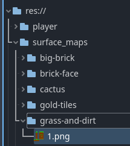
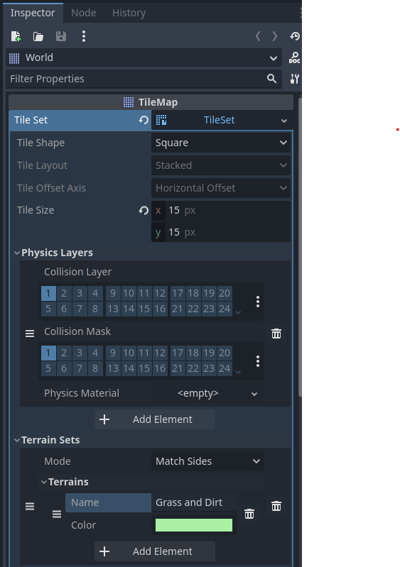
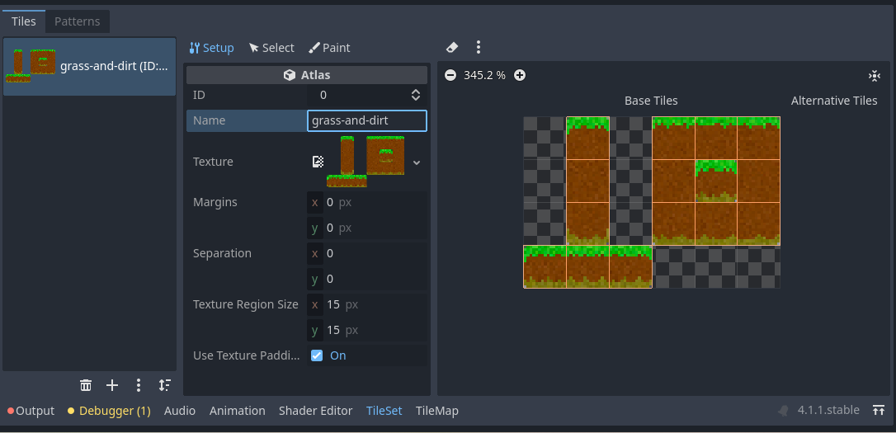
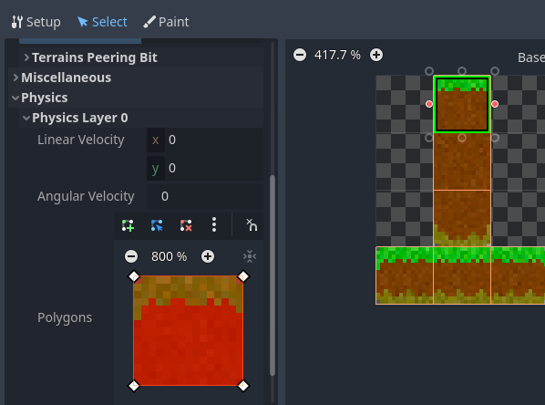
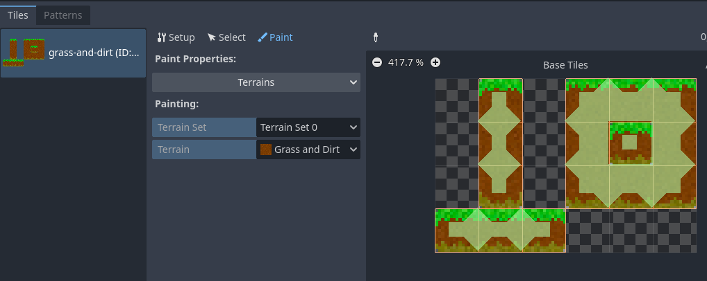
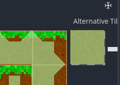
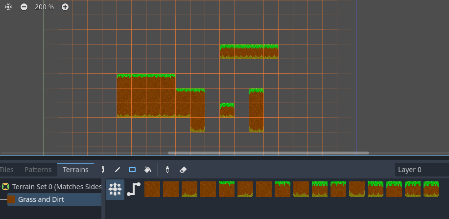
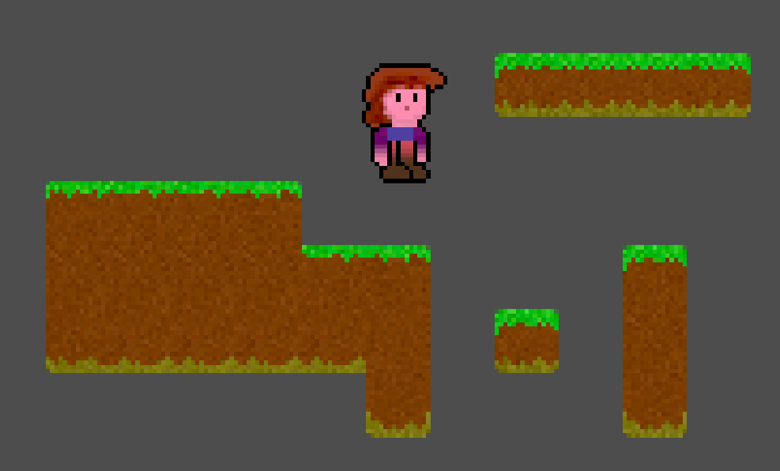
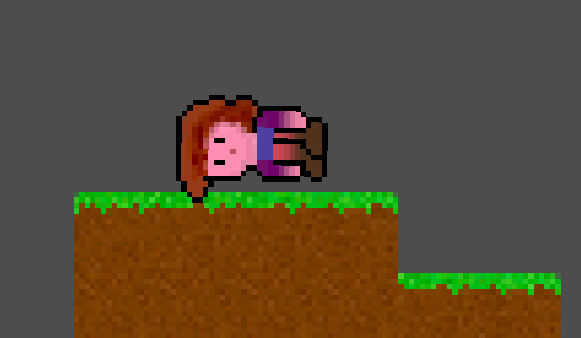
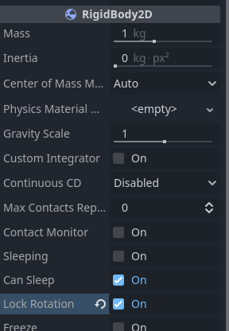

# Day 2 - Adding some tiles

So today we're going to achieve these goals:

1. Zelia will become subject to the laws of physics
2. She will move right and left by running
3. She will jump
4. A camera will follow her around

But before we can do that, we need some surfaces for her to run around on.

## Prerequisites

Before I could make this day's tutorial I had to read up on and watch:

1. [Using TileMaps](https://docs.godotengine.org/en/stable/tutorials/2d/using_tilemaps.html)
2. [Terrain Autotiling and Alternative Tiles ~ Godot 4 Tutorial for Beginners](https://www.youtube.com/watch?v=vV8uKN1VnN4)
3. [`RigidBody2D`](https://docs.godotengine.org/en/stable/classes/class_rigidbody2d.html) 

If you lost your project or want to start from here, I tagged the project after day one so you could clone or download it from [github](https://github.com/Teaching-myself-Godot/godot-zelia/tree/after-day-1)

## Addings Tiles in a `TileMap`

First make sure you have some surface assets ready. Create a new resource dir called `surface_maps` and put the contents of this [`zip`](https://github.com/Teaching-myself-Godot/rewriting-zelia-tutorial/raw/main/assets/surface_maps.zip) in it, including subdirs:



### Create the `Tilemap`

Go `Scene > New Scene` and create new scene of type `TileMap`. Then rename it to `World` by double clicking on its node.

Let's follow the steps in [Using TileMaps](https://docs.godotengine.org/en/stable/tutorials/2d/using_tilemaps.html) and the [video](https://www.youtube.com/watch?v=vV8uKN1VnN4):

1. Set the `Cell Quadrant` property to `15`
2. Create a new `TileSet` 
3. Set the `x` and `y` of the `Tile Size` property to `15px`
4. Create a `Physics Layer`
5. Create a `Terrain Set`
6. Set the `Mode` property to `Match Sides`
7. Add a `Terrain` and give it a bright green color
8. Set the `Name` property to `Grass and Dirt`

It should look like this now:



### Making an `Atlas` of an image

Next open the `Tileset` pane on the bottom and add an `Atlas` using the `+`-button.

1. Set the `Texture` property for this `Atlas` by loading the resource `res://surface_maps/grass-and-dirt/1.png`. 
2. Pick `Yes` when offered to automatically detect tiles:
3. Set the `Name` property to `grass-and-dirt`



### Add the `Terrain` and `Physics Layer` to the tiles

1. Now choose the `select` tab 
2. select all the tiles.
3. Pop open `> Terrains`.
4. Set `Terrain Set` to `0` (the number found by hovering over the `Inspector > World > Terrain Sets` property)
5. Set `Terrain` to `0`  (the number found by hovering over the `Inspector > World > Terrain Sets > Terrains` property)
6. Pop open `Physics > Physics Layer 0` (we just created that)

### Give the tiles their collision area

To Set up the collision area of a tile you can select one at a time and press the `F`-key. 

This will make a square you can change into another type of polygon (we'll do that later):



Apply this to all 15 tiles.

### Set the `Terrains Peering Bit` for each tile

You can paint this! (it's in the [video](https://www.youtube.com/watch?v=vV8uKN1VnN4)).

1. Go to the `Paint` tab.
2. Select a property editor: Terrains
3. Pick `Terrain Set 0` for `Terrain Set`
4. Pick `Grass and Dirt` for `Terrain`
5. Now paint over the tiles so they look like this:



### We need one `Alternative Tile`

There is one type of tile missing, the one that has neighbors on all four sides. 

We can achieve this by making an `Alternative Tile`.

1. Go to `Select`
2. Select the tile that is all dirt (x = 15 and y = 15)
3. Right click on it
4. Choose `Create an Alternative Tile`
5. Press `F` to give it a collision rect
6. Go back to `Paint`
7. Click on the new tile 
8. Paint it to neighbour all sides:



### Paint some terrain

If we did _all_ this correctly, now we should be able to paint some Tiles on the viewport.

1. Choose `TileMap` on the bottom of the `Tiles` tab
2. Choose the `Terrains` tab
3. Pick `Terrain Set 0 > Grass and Dirt`
4. Choose the `Rectangles` draw mode
5. Drag a rectangular area in the `World`-scene viewport.

All this work should allow you to draw these shapes into the viewport in no time:



### Don't forget to save!

I almost forgot myself. Press `Ctrl-S` to save the `World`-scene into `rest://world.tscn`

### Technical debt 3

After reading up about `TileMap` - including developers' opinions about it, I concluded that at this point I can safe create one `TileMap`-scene, call it `World`, and assume we will be making all the level content in it.

This violates some of the [SOLID](https://en.wikipedia.org/wiki/SOLID) principles, i.e. it does not separate the concern of tiles from the concern of a map/level/world, but we will accept this potential technical debt.

## Add the `Player` to the `World` scene

Let's add the `Player`-node as an instance into this `World`-scene.

Just drag her scene file from the `FileSystem` tab into the `tree view`: `res://player/player.tscn`, like in the first tutorials.

Test the current scene.

Actually make the `World`-scene the main scene by right clicking on `world.tscn` in the `FileSystem` tab and picking `Set as Main Scene`.

Use `F5` or your OS's shortcut to run the entire project.

There is a lot missing, we can't leave Zelia just _hanging_ there! (ha ha ha).



### Make her subject to the laws of physics.

Like we speculated during day 1, we need to change her `Node Type` if we do not want to write all the physics ourselves. 

And I don't. I did it last time and it took me weeks and weeks of tweaking; and there are sure to still be bugs hanging around.

1. Go to the `Player` scene view (the one where she is the root node).
2. Right click on `Player` 
3. Pick `Change type`
4. Choose `RigidBody2D`
5. Replace her attached script `res://player/player.gd` with this one line of code:

```gdscript
extends RigidBody2D # this first line changed!
```

Test by running the project.

### Tweaking her physics properties

If you let her fall from a really high place she could fall flat on her face.



This looks funny and all, but if you let her run in this state, you might understand the problem.

1. Make sure you're in the `Player` scene
2. Check `Lock Rotation` to `On` in the `Inspector`

If you check it on in the world scene this rule will _only_ apply to her instance in _that_ scene. 

We want these defaults to apply to her _class_ not her _instance_.



## Rewriting her code

Well, we have to start all over again!

In writing we call this "Kill your Darlings" ...So bye beautiful `enums`!

With the beginner's mindset, we simply call this learning. It's fun!

The [`RigidBody2D` documentation](https://docs.godotengine.org/en/stable/classes/class_rigidbody2d.html) refers to [this example project](https://godotengine.org/asset-library/asset/119). 

We will base our rewrite on the code in [this gdscript file](https://github.com/godotengine/godot-demo-projects/blob/3.5-9e68af3/2d/physics_platformer/player/player.gd) as it roughly does what we need as well...

In this first iteration you'll see a lot of copy/paste. 

I added my own observation comments starting with `->`.

These are to help me understand what is happening, not criticism on the original code.

```gdscript

```