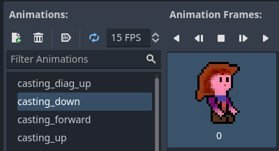

# Day 3 - Casting Fireballs

How about these goals..? For fire magic?

- Assign casting button(s)
- Determine cast direction via mouse
- Via left axis
- Draw the correct cast sprite (see to Technical debt 1)
- Handle technical debt 2: messy code
- Spawn fireballs

# notes

## TODO: write about..
1. add Fireball button (mouse left, gamepad B)
2. determine cast angle by mouse
```gdscript
# add movement state for casting
enum MovementState { IDLE, RUNNING, AIRBORNE, CASTING }

# the exact cast angle in radians
var cast_angle     : float


# add to _process_pyshics function:

	# Handle casting with left mouse button
	if Input.is_action_pressed("Fireball button mouse"):
		movement_state = MovementState.CASTING
		# base the angle of casting on the position of the mouse
		# relative to Zelia
		cast_angle = (get_global_mouse_position() - position).normalized().angle()
	elif is_on_floor():
		movement_state = MovementState.IDLE
	else:
		movement_state = MovementState.AIRBORNE
```
3. technical debt 1 fix by making single sprite cast directions



4. determine orientation and cast sprite by cast angle

```gdscript
# Determine the casting sprite name based on the cast_angle
func get_casting_sprite(deg) -> String:
	var casting_left  = (deg > 120 and deg < 180) or (deg > -180 and deg < -120)
	var casting_right = deg > -60  and deg < 60
	var casting_up    = deg > -140 and deg < -20
	var casting_down  = deg > 30   and deg < 150

	if casting_up and (casting_right or casting_left):
		return "casting_diag_up"
	elif casting_down and (casting_right or casting_left):
		return "casting_down"
	elif casting_up:
		return "casting_up"
	elif casting_down:
		return "casting_down"
	else:
		return "casting_forward"


	# Update movement state, velocity and orientation based on the combo of
	# her current movement state and environmental factors
	if movement_state == MovementState.CASTING:
		# She cannot run or move on x-axis in the air while casting
		velocity.x = 0
		# base her orientation on the angle of casting as well
		if cast_angle > -(PI * 0.5) and cast_angle < PI * 0.5:
			orientation = Orientation.RIGHT
		else:
			orientation = Orientation.LEFT
	elif movement_state == MovementState.AIRBORNE:


	# Determine sprite based on movement state
	match (movement_state):
		MovementState.RUNNING:
			$AnimatedSprite2D.animation = "running"
		# This was added
		MovementState.AIRBORNE:
			$AnimatedSprite2D.animation = "jumping"
		MovementState.CASTING:
			# when casting invoge get_casting_sprite
			$AnimatedSprite2D.animation = get_casting_sprite(rad_to_deg(cast_angle))
		_: # MovementState.IDLE
			$AnimatedSprite2D.animation = "idle"
```

5. determine cast angle by L stick

```gdscript
	# Handle casting with left fireball button
	if Input.is_action_pressed("Fireball button"):
		movement_state = MovementState.CASTING
		# base the angle of casting on the position of the mouse
		# relative to Zelia
		if Input.is_action_pressed("Left mouse button"):
			cast_angle = (get_global_mouse_position() - position).normalized().angle()
		else:
			cast_angle = Vector2(Input.get_joy_axis(0, JOY_AXIS_LEFT_X), Input.get_joy_axis(0, JOY_AXIS_LEFT_Y)).normalized().angle()
```

6. toggle full screen with world script
7. Techdebt 2 messy code -> self-documenting funcs

## TODO code
8. Add fireball interval timer
9. Add fireball node + script
10. Techdebt 2 messy code -> link to guide on code documentation comments and apply those practices

