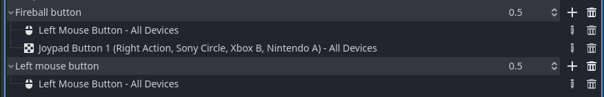

# Day 3 - Casting Fireballs

Today we're going to let Zelia cast her fireballs again.

Just some small notes:
- I changed the `Player`'s `var speed` property in `player.gd` from `120.0` to `170.0`
- I removed `@export` from the `movement_state` and `orientation` property

## The steps for today

1. [Assign casting buttons](#assign-casting-buttons)
2. [Fix the casting sprites for Zelia](#fix-the-casting-sprites-for-zelia) (Technical debt 1)
3. [Determine cast direction via mouse cursor position and L-stick axis](#determine-cast-direction-via-mouse-cursor-position-and-l-stick-axis)
4. [Rearrange the code in `_physics_process` a little](#rearrange-the-code-in-_physics_process-a-little)
5. [Draw the correct casting sprites based on cast direction](#draw-the-correct-casting-sprites-based-on-cast-direction)
6. [Extract some functions for less messy code](#extract-some-functions-for-less-messy-code) (Technical debt 2)
7. [Add a `Fireball` scene and test its flying](#add-a-fireball-scene-and-test-its-flying)
8. [Spawn fireballs when she casts](#spawn-fireballs-when-she-casts)
9. [Make fireballs collide with the `TileMap`, not with the `Player`](#make-fireballs-collide-with-the-tilemap-not-with-the-player)


# Assign casting buttons

Zelia can cast fireballs in all directions:
- when holding gamepad button `B`, you can aim with the `L-stick`
- when holding the left mouse button, you can aim with the mouse cursor.

1. Go to `Project > Project Settings`
2. Go to `Input Maps`
3. Choose `Add New Action`
4. Set the name to `Fireball button`
5. Assign `Left Mouse Button` to `Fireball button` 
6. Assign `Joypad Button 1` to `Fireball button`

Now to determine which of either is pressed we need to assign one to another name.

7. Choose `Add New Action`
8. Set the name to `Left mouse button`
9. Assign `Left Mouse Button` to `Left mouse button` 



# Fix the casting sprites for Zelia

On day one we added one `SpriteFrames` entry for all casting images. 

We should have made an entry per image to cover all her angles of casting:

1. Go to `FileSystem > res:// > player > player.tscn`
2. Go to `Scene > Player > AnimatedSprite2D`
3. On the bottom pane choose `casting`
4. Rename it to `casting_down` (click on it a second time)
5. Select the image casting forward 
6. Press `Ctrl-C` to copy it
7. Add a new `Animation` named `casting_forward`
8. Select it and press `Ctrl-V` to paste
9. Repeat this process until you have 4 entries: `casting_up`, `casting_diag_up`, `casting_forward` and `casting_down`


**Note**: that the image called `casting_down` will also be used for casting down diagonally. 

(Her arms look really silly when pointing directly down)

10. Remove the images _not_ casting down from the `casting_down` animation

# Determine cast direction via mouse cursor position and L-stick axis

Zelia can cast in all directions when holding a casting button.

Based on her angle of casting we'll pick the correct sprite.

Go to `FileSystem > player > player.gd` to edit the script.

1. Add a movement state for casting:

```gdscript
enum MovementState { IDLE, RUNNING, AIRBORNE, CASTING }
```

2. Add a property for the direction of casting

```gdscript
@export var cast_angle : float
```

3. In the `_physics_process`  set `cast_angle` and `movement_state` right above the jump code

```gdscript
	if Input.is_action_pressed("Fireball button"):
		movement_state = MovementState.CASTING
		# base the angle of casting on the position of the mouse
		# relative to Zelia
		if Input.is_action_pressed("Left mouse button"):
			cast_angle = (get_global_mouse_position() - position).normalized().angle()
		else:
			cast_angle = Vector2(Input.get_joy_axis(0, JOY_AXIS_LEFT_X), Input.get_joy_axis(0, JOY_AXIS_LEFT_Y)).normalized().angle()

	# Handle Jump, only when on the floor
```

4. Test via remote debugging

This time we will monitor the exported property `cast_angle`. 

If you forgot how, I documented it on day 1. Remote debug [see](day-1.md#test-run)

1. Run the main scene with `F5` to see if the `Cast Angle` property changes when either:
2. Pick `Remote`
3. Go to `root > World > Player`
4. Look at the inspector

Check and see if the `cast_angle` changes when you:
- left-clicking the mouse somewhere on the screen
- pressing `B` and moving the `L-stick` (the player wil slide around in IDLE mode right now)


# Rearrange the code in `_physics_process` a little

We need to rearrange our code in the `_physics_process` a little in order to achieve 2 things:
1. Let Zelia flip orientation based on her casting angle
2. Let Zelia stop moving on the x-axis while casting

Please do copy and paste the next rewrite of the entire `_physics_process`, remembering to:
- read the code carefully
- look at what changed

We will change all code this _again_ soon! For the better, I promise.

```gdscript
func _physics_process(delta):
	# Apply the gravity.
	velocity.y += gravity * delta

	# Handle casting
	if Input.is_action_pressed("Fireball button"):
		movement_state = MovementState.CASTING
		# base the angle of casting on the position of the mouse
		# relative to Zelia
		if Input.is_action_pressed("Left mouse button"):
			cast_angle = (get_global_mouse_position() - position).normalized().angle()
		else:
			cast_angle = Vector2(Input.get_joy_axis(0, JOY_AXIS_LEFT_X), Input.get_joy_axis(0, JOY_AXIS_LEFT_Y)).normalized().angle()
	elif is_on_floor():
		movement_state = MovementState.IDLE
	else:
		movement_state = MovementState.AIRBORNE

	# Update movement state, velocity and orientation based on the combo of
	# her current movement state and environmental factors
	if movement_state == MovementState.CASTING:
		# She cannot run or move on x-axis in the air while casting
		velocity.x = 0
		# base her orientation on the angle of casting as well
		if cast_angle > -(PI * 0.5) and cast_angle < PI * 0.5:
			orientation = Orientation.RIGHT
		else:
			orientation = Orientation.LEFT
	elif movement_state == MovementState.AIRBORNE:
		# If she's airborne right now
		if is_on_floor():
			# .. and hits the floor, she's idle
			movement_state = MovementState.IDLE
		elif Input.is_action_pressed("Run right"):
			# Else you can still move her right
			orientation = Orientation.RIGHT
			velocity.x = speed
		elif Input.is_action_pressed("Run left"):
			# ... and left
			orientation = Orientation.LEFT
			velocity.x = -speed
		else:
			velocity.x = 0
	else:
		# Else we are neither casting nor airborne right now
		if Input.is_action_pressed("Run right"):
			# so we run right when run right is pressed
			orientation = Orientation.RIGHT
			movement_state = MovementState.RUNNING
			velocity.x = speed
		elif Input.is_action_pressed("Run left"):
			# .. and left ...
			orientation = Orientation.LEFT
			movement_state = MovementState.RUNNING
			velocity.x = -speed
		else:
			# and stand idle if no x-movement button is pressed
			velocity.x = 0
			movement_state = MovementState.IDLE  

		# Handle Jump, only when on the floor
		if Input.is_action_just_pressed("Jump") and is_on_floor():
			$JumpSound.play()
			movement_state = MovementState.AIRBORNE
			velocity.y = jump_speed
	
	# Determine sprite based on movement state
	match (movement_state):
		MovementState.RUNNING:
			$AnimatedSprite2D.animation = "running"
		# This was added
		MovementState.AIRBORNE:
			$AnimatedSprite2D.animation = "jumping"
		_: # MovementState.IDLE
			$AnimatedSprite2D.animation = "idle"

	# Neither had this
	if orientation == Orientation.LEFT:
		$AnimatedSprite2D.flip_h = true
	else:
		$AnimatedSprite2D.flip_h = false

	# Apply 2d physics engine's movement 
	move_and_slide()
```

Test again with `F5`. Can you notice the changes?

This code snippet now flips her based on her casting angle:
```gdscript
	if movement_state == MovementState.CASTING:
		# She cannot run or move on x-axis in the air while casting
		velocity.x = 0
		# base her orientation on the angle of casting as well
		if cast_angle > -(PI * 0.5) and cast_angle < PI * 0.5:
			orientation = Orientation.RIGHT
		else:
			orientation = Orientation.LEFT
```

And this rearrangement further prevents her from moving while casting:
```gdscript
	if Input.is_action_pressed("Fireball button"):
		movement_state = MovementState.CASTING
		# base the angle of casting on the position of the mouse
		# relative to Zelia
		if Input.is_action_pressed("Left mouse button"):
			cast_angle = (get_global_mouse_position() - position).normalized().angle()
		else:
			cast_angle = Vector2(Input.get_joy_axis(0, JOY_AXIS_LEFT_X), Input.get_joy_axis(0, JOY_AXIS_LEFT_Y)).normalized().angle()
	elif is_on_floor():
		movement_state = MovementState.IDLE
	else:
		movement_state = MovementState.AIRBORNE

	# Update movement state, velocity and orientation based on the combo of
	# her current movement state and environmental factors
```

We will make _all this_ a **LOT** more maintainable soon!

# Draw the correct casting sprites based on cast direction


# Extract some functions for less messy code

# Add a `Fireball` scene and test its flying

# Spawn fireballs when she casts

# Make fireballs collide with the `TileMap`, not with the `Player`

# notes

## TODO: write about..
1. add Fireball button (mouse left, gamepad B)
2. determine cast angle by mouse
```gdscript
# add movement state for casting
enum MovementState { IDLE, RUNNING, AIRBORNE, CASTING }

# the exact cast angle in radians
var cast_angle     : float


# add to _process_pyshics function:

	# Handle casting with left mouse button
	if Input.is_action_pressed("Fireball button mouse"):
		movement_state = MovementState.CASTING
		# base the angle of casting on the position of the mouse
		# relative to Zelia
		cast_angle = (get_global_mouse_position() - position).normalized().angle()
	elif is_on_floor():
		movement_state = MovementState.IDLE
	else:
		movement_state = MovementState.AIRBORNE
```
3. technical debt 1 fix by making single sprite cast directions


4. determine orientation and cast sprite by cast angle

```gdscript
# Determine the casting sprite name based on the cast_angle
func get_casting_sprite(deg) -> String:
	var casting_left  = (deg > 120 and deg < 180) or (deg > -180 and deg < -120)
	var casting_right = deg > -60  and deg < 60
	var casting_up    = deg > -140 and deg < -20
	var casting_down  = deg > 30   and deg < 150

	if casting_up and (casting_right or casting_left):
		return "casting_diag_up"
	elif casting_down and (casting_right or casting_left):
		return "casting_down"
	elif casting_up:
		return "casting_up"
	elif casting_down:
		return "casting_down"
	else:
		return "casting_forward"


	# Update movement state, velocity and orientation based on the combo of
	# her current movement state and environmental factors
	if movement_state == MovementState.CASTING:
		# She cannot run or move on x-axis in the air while casting
		velocity.x = 0
		# base her orientation on the angle of casting as well
		if cast_angle > -(PI * 0.5) and cast_angle < PI * 0.5:
			orientation = Orientation.RIGHT
		else:
			orientation = Orientation.LEFT
	elif movement_state == MovementState.AIRBORNE:


	# Determine sprite based on movement state
	match (movement_state):
		MovementState.RUNNING:
			$AnimatedSprite2D.animation = "running"
		# This was added
		MovementState.AIRBORNE:
			$AnimatedSprite2D.animation = "jumping"
		MovementState.CASTING:
			# when casting invoge get_casting_sprite
			$AnimatedSprite2D.animation = get_casting_sprite(rad_to_deg(cast_angle))
		_: # MovementState.IDLE
			$AnimatedSprite2D.animation = "idle"
```

5. determine cast angle by L stick

```gdscript
	# Handle casting with left fireball button
	if Input.is_action_pressed("Fireball button"):
		movement_state = MovementState.CASTING
		# base the angle of casting on the position of the mouse
		# relative to Zelia
		if Input.is_action_pressed("Left mouse button"):
			cast_angle = (get_global_mouse_position() - position).normalized().angle()
		else:
			cast_angle = Vector2(Input.get_joy_axis(0, JOY_AXIS_LEFT_X), Input.get_joy_axis(0, JOY_AXIS_LEFT_Y)).normalized().angle()
```

6. toggle full screen with world script
7. Techdebt 2 messy code -> self-documenting funcs

8. Add fireball node

[assets/fireballs.zip](https://github.com/Teaching-myself-Godot/rewriting-zelia-tutorial/raw/main/assets/fireballs.zip)


[Enemy script from tutorial](https://docs.godotengine.org/en/stable/getting_started/first_2d_game/04.creating_the_enemy.html#enemy-script):

- `CollisionShape2D`
- `AnimatedSprite2D`
- [`VisibleOnScreenNotifier2D`](https://docs.godotengine.org/en/stable/classes/class_visibleonscreennotifier2d.html#class-visibleonscreennotifier2d)


```gdscript
extends Area2D

var velocity = Vector2.ZERO

func _physics_process(delta):
	position += velocity * delta

func _on_visible_on_screen_notifier_2d_screen_exited():
	queue_free()

```

Remote debug [see](day-1.md#test-run)


9. Add shoot fireball signal

[Instancing with signals](https://docs.godotengine.org/en/stable/tutorials/scripting/instancing_with_signals.html)

```gdscript
# Cast fireball signal declaration
signal cast_fire_magic(fireball, direction, location)

# Fireball class
var Fireball = preload("res://projectiles/fireball/Fireball.tscn")

func _on_fireball_interval_timer_timeout():
	if movement_state == MovementState.CASTING:
		# elegant, yet no fit:
		var origin = position + Vector2(10, 0).rotated(cast_angle) + Vector2(0, 2)
		cast_fire_magic.emit(Fireball, cast_angle, origin)
```

[Instancing](https://docs.godotengine.org/en/stable/getting_started/step_by_step/instancing.html#doc-instancing)


**Connect the signal from World scene!**

```gdscript
# world.gd
func _on_player_cast_fire_magic(Fireball, direction, location):
	var fireball = Fireball.instantiate()
	add_child(fireball)
	fireball.rotation = direction
	fireball.position = location
	fireball.velocity = Vector2.from_angle(direction) * 150
```


# Collisions

- player:   mask and layer 1 (for now)
- world:    mask and layer 1 and 2 (for now)
- fireball: mask and layer 2 (for now)

Handle fireball collision, final script

`DissipateTimer` added.

```gdscript
extends Area2D

@export var velocity = Vector2.ZERO


func _ready():
	$AnimatedSprite2D.play("default")

func _physics_process(delta):
	position += velocity * delta

func _on_visible_on_screen_notifier_2d_screen_exited():
	queue_free()

# collision with something in collision layer/mask 2
func _on_body_entered(body):
	$AnimatedSprite2D.play("dissipate")
	$DissipateTimer.start()
	velocity *= 0.1

func _on_dissipate_timer_timeout():
	queue_free()
```


- Fireball z-index changed: Show behind parent is ON!


10. Techdebt 2 messy code -> link to guide on code documentation comments and apply those practices

