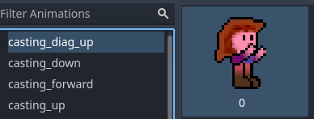
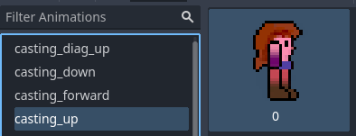
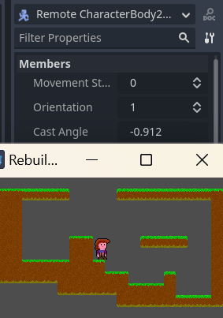

# Day 3 - Casting Sprites

Today we're going to add Zelia's casting sprites to her script.

Want to start from here? 

Clone or download the result of day 2 from [github](https://github.com/Teaching-myself-Godot/godot-zelia/tree/after-day-2)

## Learning goals

- Determine the angle between the Zelia sprite and the mouse cursor
- Determine the angle of the `L-stick`
- Using `rad_to_deg` to determing the correct casting sprite for aiming
- Code refactor to tidy up code and make it more maintainable

## The steps for today

1. [Assign casting buttons](#assign-casting-buttons)
2. [Fix the casting sprites for Zelia](#fix-the-casting-sprites-for-zelia) (Technical debt 1)
3. [Determine cast direction via mouse cursor position and L-stick axis](#determine-cast-direction-via-mouse-cursor-position-and-l-stick-axis)
4. [Rearrange the code in `_physics_process` a little](#rearrange-the-code-in-_physics_process-a-little)
5. [Draw the correct casting sprites based on cast direction](#draw-the-correct-casting-sprites-based-on-cast-direction)
6. [Extract some functions for less messy code](#extract-some-functions-for-less-messy-code) (Technical debt 2)

# Assign casting buttons

After day 3 Zelia will cast fireballs in all directions:
- when holding gamepad button `B`, you can aim with the `L-stick`
- when holding the left mouse button, you can aim with the mouse cursor.

1. Go to `Project > Project Settings`
2. Go to `Input Maps`
3. Choose `Add New Action`
4. Set the name to `Fireball button`
5. Assign `Left Mouse Button` to `Fireball button` 
6. Assign `Joypad Button 1` to `Fireball button`

Now to determine which of either is pressed we need to assign one to another name.

7. Choose `Add New Action`
8. Set the name to `Left mouse button`
9. Assign `Left Mouse Button` to your new action named `Left mouse button` 


# Fix the casting sprites for Zelia

On day 1 we added one `SpriteFrames` entry for all casting images. 

We should have made an entry per image to cover all her angles of casting:

1. Go to `FileSystem > res:// > player > player.tscn`
2. Go to `Scene > Player > AnimatedSprite2D`
3. On the bottom pane choose `casting`
4. Rename it to `casting_down` (click on it a second time)
5. Select the image casting forward 
6. Press `Ctrl-C` to copy it
7. Add a new `Animation` named `casting_forward`
8. Click on the preview window
9. Select it and press `Ctrl-V` to paste the image of Zelia casting forward
10. Repeat this process until you have 4 entries: `casting_up`, `casting_diag_up`, `casting_forward` and `casting_down`
11. Remove the images _not_ casting down from the `casting_down` animation:






**Note**: the image called `casting_down` will also be used for casting down diagonally. 

(Her arms look really silly when pointing directly down)

# Determine cast direction via mouse cursor position and L-stick axis

First let's write some code to see if we can set the angle of casting when one of the `Fireball button`s is pressed.

Later on we'll pick the correct sprite, based on her angle of casting

Go to `FileSystem > player > player.gd` to edit the script.

1. Add a movement state for casting:

```gdscript
enum MovementState { IDLE, RUNNING, AIRBORNE, CASTING }
```

2. Add a property for the direction of casting

```gdscript
@export var cast_angle : float
```

3. In the `_physics_process`  set `cast_angle` and `movement_state` right above the jump code

```gdscript
	if Input.is_action_pressed("Fireball button"):
		movement_state = MovementState.CASTING
		# base the angle of casting on the position of the mouse
		# relative to Zelia or on the L-stick
		if Input.is_action_pressed("Left mouse button"):
			cast_angle = (get_global_mouse_position() - position).normalized().angle()
		else:
			cast_angle = Vector2(Input.get_joy_axis(0, JOY_AXIS_LEFT_X), Input.get_joy_axis(0, JOY_AXIS_LEFT_Y)).normalized().angle()

	# Handle Jump, only when on the floor
```

4. Test via remote debugging

This time we will monitor the exported property `cast_angle`. 

If you forgot how, I documented it on day 1. Remote debug [see](day-1.md#test-run)

1. Run the main scene with `F5` to see if the `Cast Angle` property changes when either:
2. Pick `Remote`
3. Go to `root > World > Player`
4. Look at the inspector

Check and see if the `Cast Angle` value changes when you:
- left-click the mouse somewhere in the game window
- press `B` and move the `L-stick` (the player wil slide around in looking `idle` right now)



# Rearrange the code in `_physics_process` a little

**NOTE** This section will rearrange code to look like this, in case you get stuck: 

[player.gd](https://github.com/Teaching-myself-Godot/godot-zelia/blob/letting-zelia-stop-x-on-cast/player/player.gd)

You could also download it and [skip to the next section](#draw-the-correct-casting-sprites-based-on-cast-direction).

## Let's get started

We need to rearrange our code in the `_physics_process` a little in order to achieve 2 things:

1. Let Zelia flip orientation based on her casting angle
2. Let Zelia stop jumping and moving on the x-axis while casting

## Flipping the player left and right by aiming 

Extend the code in the `if`-block we just created for setting the `cast_angle` to include setting the `orientation`-property correctly.

```gdscript
	if Input.is_action_pressed("Fireball button"):

		## ... movement_state and cast_angle are still set here

		# base her orientation on the angle of casting as well
		if cast_angle > -(PI * 0.5) and cast_angle < PI * 0.5:
			orientation = Orientation.RIGHT
		else:
			orientation = Orientation.LEFT
```

Test using `F5`: when clicking with the mouse left of her she should now flip to look left.

## Letting Zelia stop jumping and moving on the x-axis while casting

When she's casting she should not slide sideways.

We don't want her to be able to move horizontally while casting in the air (which would make her way too powerful).

### Step 1, move casting code up, stop her from sliding

1. First move your entire `if Input.is_action_pressed("Fireball button")`-block all the way up to below `velocity.y += gravity * delta`.
2. Change `if movement_state == MovementState.AIRBORNE` into `elif movement_state == MovementState.AIRBORNE`

```gdscript
	if Input.is_action_pressed("Fireball button"):
		movement_state = MovementState.CASTING
		# base the angle of casting on the position of the mouse
		# relative to Zelia or on the L-stick
		if Input.is_action_pressed("Left mouse button"):
			cast_angle = (get_global_mouse_position() - position).normalized().angle()
		else:
			cast_angle = Vector2(Input.get_joy_axis(0, JOY_AXIS_LEFT_X), Input.get_joy_axis(0, JOY_AXIS_LEFT_Y)).normalized().angle()
		# base her orientation on the angle of casting as well
		if cast_angle > -(PI * 0.5) and cast_angle < PI * 0.5:
			orientation = Orientation.RIGHT
		else:
			orientation = Orientation.LEFT
	elif movement_state == MovementState.AIRBORNE:
```

This stops her from sliding or moving around while in the air.

### Step 2, only jump when not casting _and_ not airborne

She can still jump while casting now, let's fix that.

Indent the `if Input.is_action_just_pressed("Jump") and is_on_floor()` to make it part of the `else`-case matching not casting and not being airborne


```gdscript
	else:
		# Else we are not airborne right now
		if Input.is_action_pressed("Run right"):
			# so we run right when run right is pressed
			orientation = Orientation.RIGHT
			movement_state = MovementState.RUNNING
			velocity.x = speed
		elif Input.is_action_pressed("Run left"):
			# .. and left ...
			orientation = Orientation.LEFT
			movement_state = MovementState.RUNNING
			velocity.x = -speed
		else:
			# and stand idle if no x-movement button is pressed
			velocity.x = 0
			movement_state = MovementState.IDLE  

## This is new
		# Handle Jump, only when on the floor
		if Input.is_action_just_pressed("Jump"):
			$JumpSound.play()
			movement_state = MovementState.AIRBORNE
			velocity.y = jump_speed
```

That stopped her from jumping while casting

### Step 3, separate code for setting initial movement state from code updating positions.

This step will have no _functional_ effect, but it will prepare us for our "readable code refactor" that comes next.

**First** create this new `if-block` just under `velocity.y += gravity * delta`:

```gdscript
	# Set initial movement state
	if Input.is_action_pressed("Fireball button"):
		movement_state = MovementState.CASTING
		# base the angle of casting on the position of the mouse
		# relative to Zelia or on the L-stick
		if Input.is_action_pressed("Left mouse button"):
			cast_angle = (get_global_mouse_position() - position).normalized().angle()
		else:
			cast_angle = Vector2(Input.get_joy_axis(0, JOY_AXIS_LEFT_X), Input.get_joy_axis(0, JOY_AXIS_LEFT_Y)).normalized().angle()
	elif is_on_floor():
		movement_state = MovementState.IDLE
	else:
		movement_state = MovementState.AIRBORNE
```

**Second** Replace the old `if Input.is_action_pressed("Fireball button")`-block with this code:
```gdscript
	# Update movement state, velocity and orientation based on the combo of
	# her current movement state and environmental factors
	if movement_state == MovementState.CASTING:
		# She cannot run or move on x-axis in the air while casting
		velocity.x = 0
		# base her orientation on the angle of casting as well
		if cast_angle > -(PI * 0.5) and cast_angle < PI * 0.5:
			orientation = Orientation.RIGHT
		else:
			orientation = Orientation.LEFT
	elif movement_state == MovementState.AIRBORNE:
```

Your script should now look like this:

[player.gd  (tag = letting-zelia-stop-x-on-cast)](https://github.com/Teaching-myself-Godot/godot-zelia/blob/letting-zelia-stop-x-on-cast/player/player.gd)


# Draw the correct casting sprites based on cast direction

Let's make a well-named function to choose the correct sprite name to draw:

## `func get_casting_sprite`
```gdscript
# Determine the casting sprite name based on decimal degrees
func get_casting_sprite(deg) -> String:
	var casting_left  = (deg > 120 and deg < 180) or (deg > -180 and deg < -120)
	var casting_right = deg > -60  and deg < 60
	var casting_up    = deg > -140 and deg < -20
	var casting_down  = deg > 30   and deg < 150

	if casting_up and (casting_right or casting_left):
		return "casting_diag_up"
	elif casting_down and (casting_right or casting_left):
		return "casting_down"
	elif casting_up:
		return "casting_up"
	elif casting_down:
		return "casting_down"
	else:
		return "casting_forward"
```

As you can see, this function expects the cast_angle to be passed as `decimal degrees` in stead of `radians`.

This makes the code a little more self-documenting, at the cost of some minimal performance.

Now let's also add the case for `MovementState.CASTING` to our `match`-statement:

```gdscript
	# Determine sprite based on movement state
	match (movement_state):
		MovementState.RUNNING:
			$AnimatedSprite2D.animation = "running"
		# This was added
		MovementState.AIRBORNE:
			$AnimatedSprite2D.animation = "jumping"
		MovementState.CASTING:
			# when casting invoke get_casting_sprite to set the correct 
			# animation name
			$AnimatedSprite2D.animation = get_casting_sprite(rad_to_deg(cast_angle))
		_: # MovementState.IDLE
			$AnimatedSprite2D.animation = "idle"
```

Note the `rad_to_deg` there.

# Extract some functions for less messy code

Now it's really time to fix [Technical debt 2](day-1.md#technical-debt-2), because the debt became deeper.

**NOTE**: if you're already familiar with code refactors or want/need a reference, you can download the final code of today here:
- [player.gd](https://github.com/Teaching-myself-Godot/godot-zelia/blob/164027e6ed74a70c1222778ebcd8dffba24ec416/player/player.gd)

And if you're already quite familiar with these types of refactor, here's a skip link to day 4:
- [Day 4 - Casting fireballs](day-4.md)

## The process of tyding up code

Now there must be a pattern or best practice name for this, but here's how it goes.

Spot a function with a lot of code in the function body and do:
1. For each bit of code needs comments to explain what it does, create a function named after the comments.
2. For each block of code handling a case in an if-block write a function that says what it handles
3. For each line of code longer than your coding viewport, write functions to shorten that line
4. For each complex boolean evaluation write a function with a name that says what it does
5. For each code repetition write a function to be reused

... etcetera.

This refactor only applied step `1`, `2` and `3`

### Spot a big function and apply the steps!

Let's rewrite the above [code](#rearrange-the-code-in-_physics_process-a-little) again.

We spot that `_physics_process` is now almost 100 lines long!

Step `1` - code that needs comments:

```gdscript
	# Handle casting
	if Input.is_action_pressed("Fireball button"):
		movement_state = MovementState.CASTING
		# base the angle of casting on the position of the mouse
		# relative to Zelia or on the L-stick
		if Input.is_action_pressed("Left mouse button"):
			cast_angle = (get_global_mouse_position() - position).normalized().angle()
		else:
			cast_angle = Vector2(Input.get_joy_axis(0, JOY_AXIS_LEFT_X), Input.get_joy_axis(0, JOY_AXIS_LEFT_Y)).normalized().angle()
	elif is_on_floor():
		movement_state = MovementState.IDLE
	else:
		movement_state = MovementState.AIRBORNE
```

Is moved to a separate function named `set_movement_state`.

```gdscript
# Set initial movement state
func set_movement_state():
	if Input.is_action_pressed("Fireball button"):
		movement_state = MovementState.CASTING
		# base the angle of casting on the position of the mouse
		# relative to Zelia or on the L-stick
		if Input.is_action_pressed("Left mouse button"):
			cast_angle = (get_global_mouse_position() - position).normalized().angle()
		else:
			cast_angle = Vector2(Input.get_joy_axis(0, JOY_AXIS_LEFT_X), Input.get_joy_axis(0, JOY_AXIS_LEFT_Y)).normalized().angle()
	elif is_on_floor():
		movement_state = MovementState.IDLE
	else:
		movement_state = MovementState.AIRBORNE
```

Step `1` can be applied again to this new function:

```gdscript
# base the angle of casting on the position of the mouse relative to Zelia
func set_cast_angle():
	if Input.is_action_pressed("Left mouse button"):
		cast_angle = (get_global_mouse_position() - position).normalized().angle()
	else:
		cast_angle = Vector2(Input.get_joy_axis(0, JOY_AXIS_LEFT_X), Input.get_joy_axis(0, JOY_AXIS_LEFT_Y)).normalized().angle()

# Set initial movement state
func set_movement_state():
	if Input.is_action_pressed("Fireball button"):
		movement_state = MovementState.CASTING
		set_cast_angle()
	elif is_on_floor():
		movement_state = MovementState.IDLE
	else:
		movement_state = MovementState.AIRBORNE
```

Now both step `2` and `3` still apply to this new function:

```gdscript
# Vector of L-stick
func get_l_stick_axis_vec() -> Vector2:
	return Vector2(
		Input.get_joy_axis(0, JOY_AXIS_LEFT_X), 
		Input.get_joy_axis(0, JOY_AXIS_LEFT_Y)
	)

# Vector from player to mouse position
func get_mouse_vec_to_player() -> Vector2:
	return get_global_mouse_position() - position

# base the angle of casting on the position of the mouse relative to Zelia
func set_cast_angle():
	if Input.is_action_pressed("Left mouse button"):
		cast_angle = get_mouse_vec_to_player().normalized().angle()
	else:
		cast_angle = get_l_stick_axis_vec().normalized().angle()
```

### Rinse and repeat!

Now we spot this elaborate comment: 

_"Update movement state, velocity and orientation based on the combo of her current movement state and environmental factors"_

Applying the refactor steps listed previously do:
1. Create a function `handle_movement_state`
2. Cut+paste all the code under the long comment up to above the `match` call into `handle_movement_state`
3. Call `handle_movement_state()` after `set_movement_state()`
4. Create a func `handle_casting`
5. Cut+paste all the code within the block `if movement_state == MovementState.CASTING:` into it
6. Call `handle_casting()` in this if block
7. Do the same for `handle_airborne()` under `elif movement_state == MovementState.AIRBORNE:`
8. And make 2 functions to be called under `else:` - `handle_running()` and `handle_jumping()`

Your final func `handle_movement_state()` should now look like this.

```gdscript
# Main movement state handler entry point
func handle_movement_state():
	if movement_state == MovementState.CASTING:
		handle_casting()
	elif movement_state == MovementState.AIRBORNE:
		handle_airborne()
	else:
		handle_running()
		handle_jumping()
```

### Just 2 more funcs!

1. Create the function `set_current_sprite`
2. Put the entire block of `match (movement_state):` in it
3. Invoke it under `handle_movement_state()`

And :

1. Create the function `flip_current_sprite`
2. Put the entire if-else block of `if orientation == Orientation.LEFT:` in it
3. Invoke it under `set_current_sprite()`


## All tidied up 

Your `_physics_process` should now look like this:

```gdscript
# Changed _process to _physics_process
func _physics_process(delta):
	# Apply the gravity.
	velocity.y += gravity * delta

	# Set, and handle movement state 
	set_movement_state()
	handle_movement_state()

	# Set the correct sprite based on movement state
	set_current_sprite()

	# Determine sprite-flip based on orientation
	flip_current_sprite()

	# Apply 2d physics engine's movement 
	move_and_slide()
```

And everything should still work.

Your entire `player.gd` script should look like this:

[`player.gd`](https://github.com/Teaching-myself-Godot/godot-zelia/blob/164027e6ed74a70c1222778ebcd8dffba24ec416/player/player.gd) - on github commit: _"use my own tutorial for day-3 part 1."_


# Technical debt 5

Two observation on remaining technical debt:

- Our comments probably do not conform to documentation guidelines
- Some coding conventions might not comply either

Let's park that and go right on ahead to:

[Day 4 - Casting Fireballs](day-4.md)
