# Day 4 - Casting Fireballs

Today we're going to let Zelia cast fireballs.

Want to start from here? 

Clone or download the result of day 3 from [github](https://github.com/Teaching-myself-Godot/godot-zelia/tree/after-day-3)

## The steps for today

1. [Add a `Fireball` scene and test its flying](#add-a-fireball-scene-and-test-its-flying)
2. [Spawn fireballs when she casts](#spawn-fireballs-when-she-casts)
3. [Make fireballs collide with the `TileMap`, not with the `Player`](#make-fireballs-collide-with-the-tilemap-not-with-the-player)
4. [Generate renditions to make the fireball dissipate](#generate-renditions-to-make-the-fireball-dissipate)

# Add a `Fireball` scene and test its flying

We will use a single `.png` image as a resource for the fireball. You can download it here:

[assets/fireball.png](https://github.com/Teaching-myself-Godot/rewriting-zelia-tutorial/raw/main/assets/fireball.png)

## Adding the fireball image asset and Fireball scene

1. Create a resource dir `res://projectiles/fireball`
2. Place `fireball.png` inside
3. Create a new `Area2D` scene and call it `Fireball`
4. Save it in `res://projectiles/fireball/fireball.tscn`
5. Add these child-nodes:
- `AnimatedSprite2D`
- `CollisionShape2D`
6. Add a `SpriteFrames` to the `AnimatedSprite2D`-node
7. Drag the `fireball.png` into its `default` animation
8. Use a `CircleShape2D` for the `CollisionShape2D` and draw it like this:

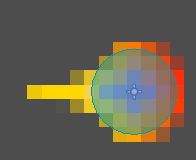


Although we are using only one image, we are using `AnimatedSprite2D`, not simply `Sprite2D`.

This is beacause in [step 4](#generate-renditions-to-make-the-fireball-dissipate) we will generate rendition images dynamically for a 'dissipating' animation.

## Let it fly

To make the fireball fly takes a very short script.

Attach a script to the fireball scene by right-clicking `Scene > Fireball` and picking `Attach Script` from the context menu. 

Leave the defaults in place, and write the script:

```gdscript
extends Area2D

# Initialize the fireball with zero speed (x = 0, y = 0)
@export var velocity = Vector2.ZERO

func _physics_process(delta):
	# Update position by velocity-vector
	position += velocity * delta
```

We exported the `velocity`-property so we can test this code.

Run the current scene by pressing `F6`.

Wile the scene is running:
1. Go to `Scene > Remote > root > Fireball`
2. Make sure the game window is visible
3. Find `Inspector > Members > Velocity`
4. Set `x` to `50`:

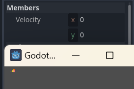

This makes the fireball fly out the viewport to the right, never to return.

If we're going to spawn hundreds of thousands of them, it will become a dire memory leak.

## Clean it up

To clean up the potential mess, we'll follow some instructions about nodes leaving the viewport from here:

Enemy script from: [_"My First 2D Game"_](https://docs.godotengine.org/en/stable/getting_started/first_2d_game/04.creating_the_enemy.html#enemy-script):

Following these steps, we will now:

1. Add a [`VisibleOnScreenNotifier2D`](https://docs.godotengine.org/en/stable/classes/class_visibleonscreennotifier2d.html#class-visibleonscreennotifier2d)
2. In the `2D` scene view make sure the `Rect` surrounds the fireball

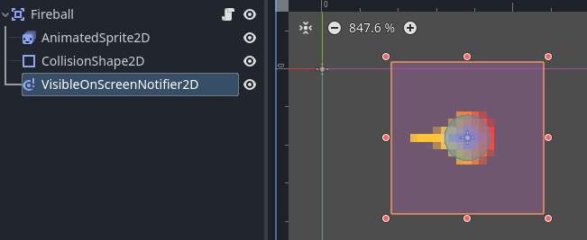

3. Click on `Node` next to `Inspector`
4. Double click `Signals > screen_exited()`
5. Leave defaults in tact and click `Connect`
6. Now add this line to the new function `_on_visible_on_screen_notifier_2d_screen_exited`:

```gdscript
func _on_visible_on_screen_notifier_2d_screen_exited():
	queue_free()
```

Run the current scene again by pressing `F6` and repeat the remote debugging instructions, setting x to `50`


Now look at the node-tree under `Scene` until the fireball exits the game viewport.

Congratulations, we deleted it.

# Spawn fireballs when she casts

If you've looked at the [original Zelia game](https://renevanderark.itch.io/zelia-mystery-mage-and-adventure-maker), you know that she does not fire on button-press/click, but on fixed intervals while holding a button:

## Add a `FireballIntervalTimer`

1. Go to `FileSystem > player > player.tscn`
2. Add a `Timer`-node to the `Player`-node
3. Name it `FireballIntervalTimer`
4. Go to the `Inspector`-tab:
5. Set `Wait Time` to `0.1`
6. Make sure the `One Shot`-property is checked `Off`
7. Check `On` the `Autostart`-property

This makes sure that the `FireballIntervalTimer` is activated when the `Player` is instantiated. 

So, in our current case, when the game starts.

8. Go to the `Node`-tab (next to `Inspector`)
9. Double-click the `timeout()`-signal
10. Keep the defaults and click `Connect`

So now, let's check if our new listener `_on_fireball_interval_timer_timeout()` is set up properly:

```gdscript
func _on_fireball_interval_timer_timeout():
	print("Pow!")
```

Test by pressing `F5`, and look at the console:

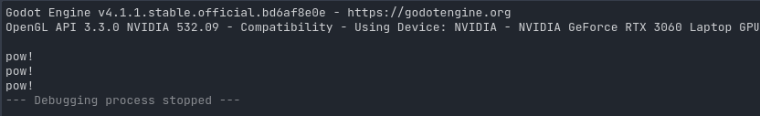

Ok, so the `FireballIntervalTimer` works, but she should only shoot fireballs when holding the `Fireball button`:

```gdscript
func _on_fireball_interval_timer_timeout():
	if movement_state == MovementState.CASTING:
		rint("Pow!")
```

That's better. Let's shoot the fireballs next.

## Spawning the fireballs

For this section we follow these guides from the godot tutorials:
- [Instancing](https://docs.godotengine.org/en/stable/getting_started/step_by_step/instancing.html#doc-instancing)
- [Instancing with signals](https://docs.godotengine.org/en/stable/tutorials/scripting/instancing_with_signals.html)

The main take-away here is to make sure the `Fireball`-scene is loosely coupled from the `Player`-scene; it lives a life of its own.

This also keeps it testable in isolation, like we did earlier.

### Add the Fireball scene to the main scene
We will however need to be able to access it from the main scene of our game: 

1. Open `FileSystem > res://world.tscn`
2. Connect the `Fireball`-scene to it by either/or
- Dragging `fireball.tscn` from the `FileSystem` tab into the `World`-tree
- Clicking the `Instantiate Child Scene` button:


That made _one_ `instance` of the `Fireball`-scene as a direct child of the `World`-scene. 

It kinda just sits there, being visible:

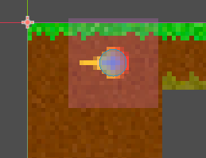

We can fix that by toggling off visibility here:

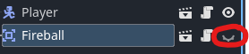

### Declare and invoke a signal to "cast spells"

What we're doing next is explained in detail in [Instancing with signals](https://docs.godotengine.org/en/stable/tutorials/scripting/instancing_with_signals.html).

We're just going to apply here what we learned.

```gdscript
## top of script
# Preload the Fireball class, used to identify it in cast_projectile
var Fireball = preload("res://projectiles/fireball/fireball.tscn")

# Declare a signal to cast a projectile spell (like Fireball) 
# in the given direction, from the given origin
signal cast_projectile(spell_class, direction : Vector2, origin : Vector2)

## bottom of script
# Spawn a fireball every 100ms if Fireball button is held
func _on_fireball_interval_timer_timeout():
	if movement_state == MovementState.CASTING:
		# Signal that a fireball should be cast at casting angle and 
		# from Player's position
		cast_projectile.emit(Fireball, cast_angle, position)
```

### Let the world scene listen to the signal

The main scene of our game (currently `World`) should get a script with a listener to the casting signal.

Upon that signal, it must `instantiate` a new `Fireball`-node and let it fly:

1. Go to `FileSystem > world.tscn`
2. Right click the `World`-node and choose `Attach Script`
3. Use the defaults and click `Create`
4. Clear the script to one line:

```gdscript
extends TileMap
```

5. Click on the `Player`-**child-node** _of_ `World`
6. Pick `Node` next to `Inpector`
7. Double click `cast_projectile(...)`
8. Leave defaults to `Connect` to `World`
9. Implement `_on_player_cast_projectile` like this:

```gdscript
# world.gd
func _on_player_cast_projectile(spell_class, direction, origin):
	var spell = spell_class.instantiate()
	add_child(spell)
	spell.rotation = direction
	spell.position = origin
	spell.velocity = Vector2.from_angle(direction) * 150.0
```

Test the main scene using `F5`

**NOTE**: the fireball should come from her belly in the center at this time. If you made the _same mistake I did_ it might spawn out at another place. 

**FIX**: The rootnode `Fireball` of the `fireball.tscn`-scene should be in the center of its sprite; it's a subtle grey-plus on the `2D`-scene until you click on it.

### Fix the fireballs' origin, tweak casting sprites with angle of fireball

So we don't want Zelia to shoot fire from her belly, but from her hands.

This script calculates a new and better origin.
```gdscript
# Spawn a fireball every 100ms if Fireball button is held
func _on_fireball_interval_timer_timeout():
	if movement_state == MovementState.CASTING:
		# Signal that a fireball should be cast at casting angle and 
		# from Player's hands
		var origin = position + Vector2(20, 0).rotated(cast_angle) + Vector2(0, 2)
		cast_projectile.emit(Fireball, cast_angle, origin)
```
So the `var origin` is calculated by applying 3 transformations:
1. Create a 'point' at position x=20, y=0 and rotate it by the casting angle: `Vector2(20, 0).rotated(cast_angle)`
2. Move it relative to Zelia's center (`position + `)
3. Move it 2 pixels down `+ Vector(0, 2)`

Also, her hands do not match up as nicely with the fireballs as they did in the original game. Use these new angles to determine `casting_up` and `casting_down` in `get_casting_sprite` for better effect:
```gdscript
	var casting_up    = deg > -160 and deg < 0
	var casting_down  = deg > 30   and deg < 160
```

# Make fireballs collide with the `TileMap`, not with the `Player`

At the moment fireballs still fly out the game window. We want then to collide with the terrain tiles, however. 

Let's look at the [tutorial](https://docs.godotengine.org/en/stable/getting_started/first_2d_game/03.coding_the_player.html#preparing-for-collisions) once more and apply:

1. Open the fireball scene `FileSystem > res://projectiles/fireball/fireball.tscn`
2. Select `Scene > Fireball`
3. Go to `Node` next to `Inspector`
4. Double click on the `body_entered(body: Node2D)` signal
5. Leave defaults on and click `Connect`
6. To remove them we could use `queue_free()` again:

```gdscript
func _on_body_entered(body):
	queue_free()
```

That works, the fireball collides when it hits the `Tilemap`. However..

..It will also disappear if it collides with the `Player`. 

## `Collision Layer` and `Collision Mask`

To illustrate, make set its origin the `position`-property of the player again in `player.gd`:

```gdscript
		# comment out the next line with Ctrl+k
#		var origin = position + Vector2(20, 0).rotated(cast_angle) + Vector2(0, 2)
		# replace origin with position in next line
		cast_projectile.emit(Fireball, cast_angle, position)
```

Depending on whether the fireballs are drawn over or behind the `Player` you will see either/or:
- them pop in and out of existence
- not at all

This is because their `Collision Mask` overlaps the `Collision Layer` of the player. The answers here explain it nicely:
[What's the difference between Collision layers and Collision masks?](https://ask.godotengine.org/4010/whats-difference-between-collision-layers-collision-masks)

Let's apply what we've learned here like this:
- `Player`: set both mask and layer to 1 (for now)
- `World > TileSet`: set both mask and layer to 1 _and_ 2 (for now)
- `Fireball`: set both mask and layer to 2 (for now)

 `Player` is already set correctly. However, we might want more granularity later.

### Setting `Collision Layer` and `Collision Mask` for `Fireball`

This is a set of properties most easily manipulated in the `Inpector`.

1. Select `res://projectiles/fireball/fireball.tscn`
2. Click on the `Fireball` node
3. Go to `Inspector > Collision`
4. set both mask and layer to 2 (for now)

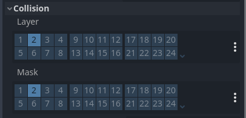


### Setting it for `World`

But to set it for the `World` scene, be aware you also need to click on `Inspector > Tile Set > TileSet > Physics Layers` as it is a property not of the `TileMap`, but of (one of) its `TileSet`(s)' `Physics Layer`(s) --> if you can still follow.

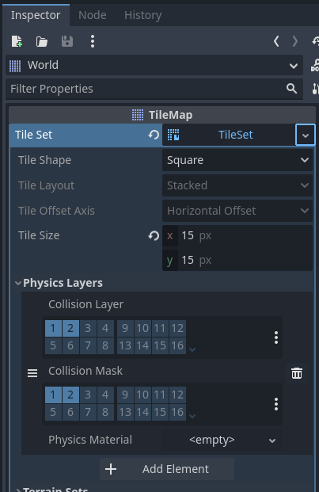

### Test again 

Press `F5` to test if the fireballs _do_ collide with the `Tilemap` and _do not_ collide with the `Player`. 

Then change back the `player.gd` script:
```gdscript
		var origin = position + Vector2(20, 0).rotated(cast_angle) + Vector2(0, 2)
		cast_projectile.emit(Fireball, cast_angle, origin)
```

## Add some smoothness to the collided fireballs

Right now the fireballs disappear very abrubtly because `queue_free()` is invoked immediately.

We can smoothe this out a little by introducing a delay and slowing them down on impact:

1. Go to `fireball.tscn`
2. Give it a `Timer` child node and call it `DissipateTimer`
3. Check `Inspector > One Shot` to `On`
4. Set the `Wait Time` to `0.5`
5. Change+Add this script to `fireball.gd`:

```gdscript
func _on_body_entered(body):
	# start the new timer in stead of calling queue_free here
	$DissipateTimer.start()
	# slow it down to 1/10th the speed
	velocity *= 0.1
```

6. Click `DissipateTimer`-node
7. Connect the `Node > timeout()`-signal to the `Fireball`
8. Implement `_on_dissipate_timer_timeout()` like so:

```gdscript
func _on_dissipate_timer_timeout():
	queue_free()
```

That's only a little better. We need an animation to make them fade into non-existence slowly.

# Generate renditions to make the fireball dissipate

We could make this very ease on ourselves by drawing images manually in our [favourite image manipulation program](https://www.gimp.org/), but we'll do it the lazy way.

Well, that is to say, the programmer's way, a.k.a. the reusable way. Remembering the original game we see a lot of stuff disappear in the same, lazy, reused way. We want to know how, right?

## Using `Autoload` for preprocessing

So looking at the documentation it becomes clear that you can easily manipulate texture images using these two classes:
- [Image](https://docs.godotengine.org/en/stable/classes/class_image.html#class-image)
- [ImageTexture](https://docs.godotengine.org/en/stable/classes/class_imagetexture.html)

But what is less evident is how to do it only _one_ time, in stead of all the `100.000`+ times a fireball collides. That would _not_ perform _at all_.

Luckily, when you search the docs for "`Singleton`" (my fifth attempt) you find the `Autoload`-class, which is meant for precisely this:

- [Singletons (Autoload)](https://docs.godotengine.org/en/stable/tutorials/scripting/singletons_autoload.html)

So, let us apply the steps and the test if we set it up properly.

1. Go to `Project > Project Settings > Autoload` (4th tab)
2. Click on the `Node Name` input
3. Type in `TextureRenditions`, which will be the name of our first `Autoload`
4. Click `Add`
5. In the dialog, leave the defaults, creating a new script `res://texture_renditions.gd`
6. Leave the `Global Variable`-checkbox check on to `Enable`
7. Close the `Project Settings`-dialog again.
8. Enter this test script in the file `texture_renditions.gd`:

```gdscript
extends Node

var singleton_test : String

func _ready():
	singleton_test = "singleton_test"
	print("asserting this print is called only once")
```

Run the project with `F5` and confirm in the console that yes indeed: 
```
asserting this print is called only once
--- Debugging process stopped ---
```

Also, test if `TextureRenditions.singleton_test` is indeed a globally accessible string in `fireball.gd`:
```gdscript
func _ready():
	print(TextureRenditions.singleton_test)
```

Run the project again and confirm in the console after shooting some fireballs:
```
singleton_test
singleton_test
singleton_test
singleton_test
--- Debugging process stopped ---
```

## Generate the dissipate animation with `Image` and `ImageTexture`

So now we want to prepare the animation for the fireball in our `Autoload`-node called `TextureRenditions`. Open the `texture_renditions.gd` script again.

1. Use `preload` to open the `fireball.png` texture and get an instance of its `Image`:
```gdscript
extends Node

var fireball = preload("res://projectiles/fireball/fireball.png").get_image()
```
2. Prepare a global array to hold the preprocess images:
```
var fireball_dissipate : Array = []
```
3. In the `_ready()` function add this line:
```gdscript
func _ready():
	fireball_dissipate = get_dissipate_renditions(fireball)
```
4. And then write the function `get_dissipate_renditions(...)`
```gdscript
# Test if we can make one gray fireball first
func get_dissipate_renditions(src_rendition):
	# Create a new Image instance with the same properties as the source image
	var dst_rendition = Image.create(src_rendition.get_width(), src_rendition.get_height(), false, src_rendition.get_format())
	# Loop through all the pixels
	for x in range(src_rendition.get_width()):
		for y in range(src_rendition.get_height()):
			# Get the original color
			var src_color = src_rendition.get_pixel(x, y)
			# Set red, green and blue to the red of the source color
			# and keep the source alpha transparency
			dst_rendition.set_pixel(x, y, Color(src_color.r, src_color.r, src_color.r, src_color.a))
	# return a list of one gray-scaled image rendition
	# converted to an instace of ImageTexture
	return [ImageTexture.create_from_image(dst_rendition)]
```
5. Now edit `fireball.gd`, edit `_ready()` like this:

```gdscript
func _ready():
	# Start playing the "default" animation
	$AnimatedSprite2D.play("default")
	# Add a new animation to the SpriteFrames instance of the $AnimatedSprite2D node
	$AnimatedSprite2D.sprite_frames.add_animation("dissipate")
	# Loop through all rendition images in the global singleton fireball_dissipate
	for rendition in TextureRenditions.fireball_dissipate:
		# Add them as a frame to 
		$AnimatedSprite2D.sprite_frames.add_frame("dissipate", rendition)
```
6. And change the animation on impact in `_on_body_entered`:
```gdscript
func _on_body_entered(body):
	# play the dissipate animation we coded
	$AnimatedSprite2D.play("dissipate")
	# start the new timer in stead of calling queue_free here
	$DissipateTimer.start()
	# slow it down to 1/10th the speed
	velocity *= 0.1
```

Test the project with `F5`. You should now see gray fireballs after collision:

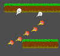

### The actual rendition script

Now that we established a simple list of one gray fireball rendition worked, let's finish up the rendition script in `texture_renditions.gd`:
```gdscript
func _ready():
	fireball_dissipate = get_dissipate_renditions(fireball, 30, 1, 0.25)

# Return a list of dissipating image renditions as an ImageTexture-Array
# - src_rendition is the original Image
# - amount is the amount of times to repeat the rendition effect
# - scatter is the chance of a pixel being rendered again in a given rendeition
# - fade is the factor by which the alpha channel transparency should be reduced 
# in each rendition
func get_dissipate_renditions(src_rendition : Image, amount : int = 14, scatter : int = 1, fade : float = 0.5):
	var renditions = []
	for n in range(amount):
		# Create a new Image instance with the same properties as the source image
		var dst_rendition = Image.create(src_rendition.get_width(), src_rendition.get_height(), false, src_rendition.get_format())
		# Loop through all the pixels
		for x in range(src_rendition.get_width()):
			for y in range(src_rendition.get_height()):
				# Get the original color
				var src_color = src_rendition.get_pixel(x, y)
				# Copy the source pixel if the random int between 0 and scatter
				# hits one
				if randi_range(0, scatter) == 1:
					# Copy the pixel, reduce opacity by factor fade
					dst_rendition.set_pixel(x, y, Color(src_color.r, src_color.g, src_color.b, src_color.a * fade))
		
		# append this rendition to result array
		renditions.append(ImageTexture.create_from_image(dst_rendition))
		# overwrite the src_rendition variable with a new empty image
		src_rendition = Image.create(src_rendition.get_width(), src_rendition.get_height(), false, src_rendition.get_format())
		# copy the current rendition into this variable entirely to be
		# manipulated in the next iteration
		src_rendition.copy_from(dst_rendition)
	# return the list of amount renditions
	return renditions
```

Upon testing with `F5`, we should now see something like this:

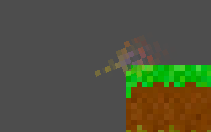


Tastes may differ, but personally I enjoy the fact that the random scatter in our renditions makes the fireball dissipate a little differently every time we play the game.

### Final touch: show behind parent

The fireball looks nicer if it's not drawn _over_ the tiles (nor anything else). Drawing it behind the tiles (_and_ everything else) makes it look like it really burns the target a little.

There is a checkbox for that as well!

1. Open the `Fireball` scene
2. Click the `Fireball`-node
3. Open the `Inspector`
4. Check the `Visibility > Show Behind Parent`-property to `On`

This works because in our main scene, `World`, the `TileMap` is the parent node of the `Fireball`-instances.

Test again:

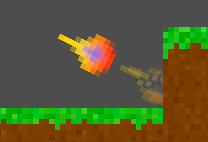


