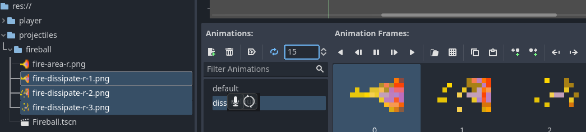

# Day 4 - Casting Fireballs


## The steps for today

1. [Add a `Fireball` scene and test its flying](#add-a-fireball-scene-and-test-its-flying)
2. [Spawn fireballs when she casts](#spawn-fireballs-when-she-casts)
3. [Make fireballs collide with the `TileMap`, not with the `Player`](#make-fireballs-collide-with-the-tilemap-not-with-the-player)

# Add a `Fireball` scene and test its flying

TODO write about fireball node stuff:

[assets/fireballs.zip](https://github.com/Teaching-myself-Godot/rewriting-zelia-tutorial/raw/main/assets/fireballs.zip)


[Enemy script from tutorial](https://docs.godotengine.org/en/stable/getting_started/first_2d_game/04.creating_the_enemy.html#enemy-script):

- `CollisionShape2D`
- `AnimatedSprite2D`
- [`VisibleOnScreenNotifier2D`](https://docs.godotengine.org/en/stable/classes/class_visibleonscreennotifier2d.html#class-visibleonscreennotifier2d)




```gdscript
extends Area2D

var velocity = Vector2.ZERO

func _physics_process(delta):
	position += velocity * delta

func _on_visible_on_screen_notifier_2d_screen_exited():
	queue_free()

```

Remote debug:


# Spawn fireballs when she casts

TODO write about fireball spawning!

[Instancing with signals](https://docs.godotengine.org/en/stable/tutorials/scripting/instancing_with_signals.html)

```gdscript
# Cast fireball signal declaration
signal cast_fire_magic(fireball, direction, location)

# Fireball class
var Fireball = preload("res://projectiles/fireball/Fireball.tscn")

func _on_fireball_interval_timer_timeout():
	if movement_state == MovementState.CASTING:
		# elegant, yet no fit:
		var origin = position + Vector2(10, 0).rotated(cast_angle) + Vector2(0, 2)
		cast_fire_magic.emit(Fireball, cast_angle, origin)
```


[Instancing](https://docs.godotengine.org/en/stable/getting_started/step_by_step/instancing.html#doc-instancing)


**Connect the signal from World scene!**

```gdscript
# world.gd
func _on_player_cast_fire_magic(Fireball, direction, location):
	var fireball = Fireball.instantiate()
	add_child(fireball)
	fireball.rotation = direction
	fireball.position = location
	fireball.velocity = Vector2.from_angle(direction) * 150
```


# Make fireballs collide with the `TileMap`, not with the `Player`

TODO write about:

- player:   mask and layer 1 (for now)
- world:    mask and layer 1 and 2 (for now)
- fireball: mask and layer 2 (for now)

Handle fireball collision, final script

`DissipateTimer` added.

```gdscript
extends Area2D

@export var velocity = Vector2.ZERO


func _ready():
	$AnimatedSprite2D.play("default")

func _physics_process(delta):
	position += velocity * delta

func _on_visible_on_screen_notifier_2d_screen_exited():
	queue_free()

# collision with something in collision layer/mask 2
func _on_body_entered(body):
	$AnimatedSprite2D.play("dissipate")
	$DissipateTimer.start()
	velocity *= 0.1

func _on_dissipate_timer_timeout():
	queue_free()
```


- Fireball z-index changed: Show behind parent is ON!

