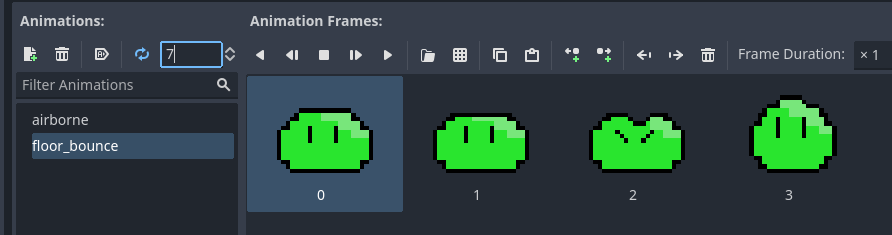
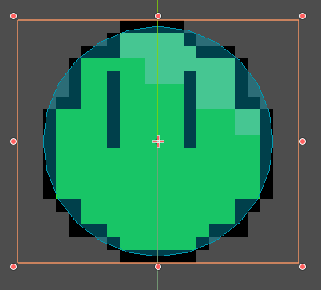
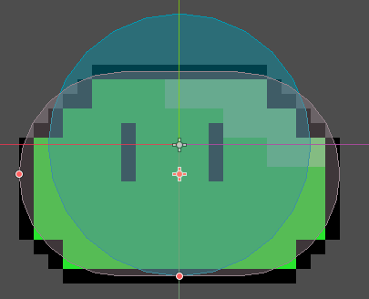
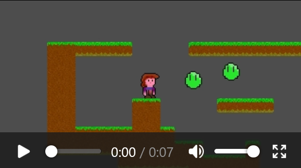
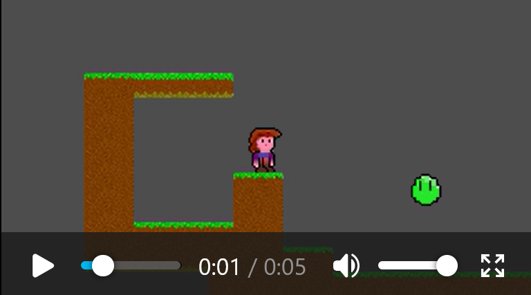
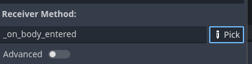
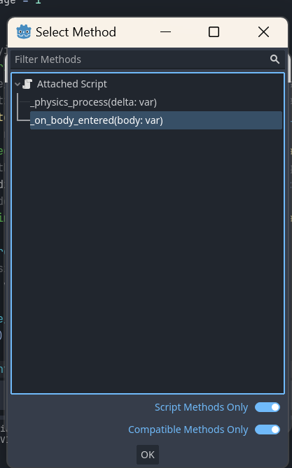
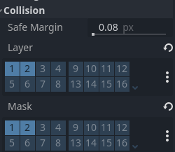
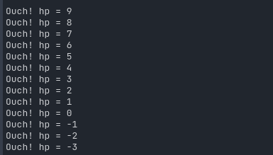
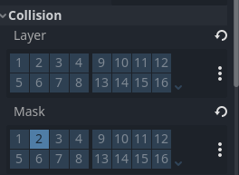

# Slimes, Breaking tiles, Falling Tiles, Scenery Tiles and Shaders

So for you it is day five, for me it's now day 14. :D

## Why so slow?

The reason is the research I did into Godot stuff you don't get out of the box:

- recipes that are stably invented for version 3, but need some translation to 4.1
- shading language concepts (last time I tried _that_ was back when GLSL was just released)
- which 'physics'-body to use for what and how (Rigid -> Static -> Rigid -> Character -> Area -> Static -> Rigid -> ooooh... I used the wrong method to apply the motion!)
- where's that polygon?! TileMap -> get_used_cells() -> TileData -> no ... TileMap -> get_used_cells() -> TileSetSource -> TileSet**Atlas**Source -> TileData -> get_collision_polygon_points() -> no?? ... yes! ... forgot to draw a polygon!

You're going to be spoiled with some 4.1 reïnvented recipes! (I hope)

## Any other excuses?

And the other reason is: my son wanted to write a 2.5D game last weekend: [Untitled Shoot 'em Up](https://github.com/Teaching-myself-Godot/untitled-shoot-em-up/tree/master)


## What we'll do today

1. [Make a bouncing Slime monster](#make-a-bouncing-slime-monster)
2. [Add the tree-trunk terrain](#add-the-tree-trunk-terrain)
3. [Make tiles Zelia can break](#make-tiles-zelia-can-break)
4. [Allow those breakable tiles to fall down](#allow-those-breakable-tiles-to-fall-down)
5. [Reuse tiles as background scenery](#reuse-tiles-as-background-scenery)
6. [Review my failed attempt to replace my TextureRenditions singleton with shaders](#review-my-failed-attempt-to-replace-my-texturerenditions-singleton-with-shaders)


# Make a bouncing Slime monster

Every game needs one.

## Setting up the slime scene

1. Download the zip: [assets/green-slime.zip](https://github.com/Teaching-myself-Godot/rewriting-zelia-tutorial/raw/main/assets/green-slime.zip)
2. Create the resource dirs `res://monsters/slime/green`
3. Extract the .png files in that `res://monsters/slime/green` dir 
4. Create a new `CharacterBody2D`-scene
5. Rename it to `Slime`
6. And save it into `res://monsters/slime/slime.tscn`
7. Give slime a child node `AnimatedSprite2D`
8. Navigate to its `Inspector Sprite Frames > SpriteFrame > Animations`
9. Change `default` into `airborne`, add `slime/green/5.png` to it
10. Add `floor_bounce` and add `1.png` - `4.png` to that -> in that order
11. Set `floor_bounce` to `7 fps` for the nicest effect:



### Add `2` collision shapes

Because our slime looks a little different depending on what state it's in, let's give it 2 collision shapes:

1. Add a child `CollisionShape2D`-node to `Scene > Slime` 
2. Name it: `AirborneCollisionShape`
3. Pick `CircleShape2D` under `Inspector > Shape`
4. Align it nicely around the `airborne` animation sprite:



Next:
1. Add another child `CollisionShape2D`-node to `Scene > Slime` 
2. Name it: `FloorBounceCollisionShape`
3. Pick `CapsuleShape2D` under  `Inspector > Shape`
4. Align it around the first `floor_bounce` animation sprite:



## Setting up the `slime.gd` script

Add the slime to the main scene:

1. Open `res://world.tscn`
2. Drag at least one slime scene `res://monsters/slimes/slime.tscn` into the `World`-scene
3. Test the main scene `World` with `F5` and observe that the slime hangs there doing nothing:


4. Open the `res://monsters/slimes/slime.tscn` scene
5. Attach a script to it, picking the default values in the dialog
6. You might notice a lot of suggested code for a `CharacterBody2D` - although it could be fun to try it out, it's not what we're looking for.
7. Remove all code and replace the `_physics_process` function body with `pass`:

```gdscript
extends CharacterBody2D


func _physics_process(delta):
	pass
```

### Adding the `MovementState`s

We have 2 animations currently, so let's create 2 movement states to match:
```gdscript
extends CharacterBody2D

enum MovementState { AIRBORNE, FLOOR_BOUNCE }

var movement_state : int

func _ready():
    # assume it starts out hanging in the air
    movement_state = MovementState.AIRBORNE

    # start up the correct animated sprite sprite frames for that state
	$AnimatedSprite2D.animation = "airborne"
	$AnimatedSprite2D.play()

```

We also know the slime must bounce around. We can use some familiar stuff for that:

```gdscript
# We want the level designer to be able to modify stuff like this.
@export var JUMP_VELOCITY = -400.0
var gravity = ProjectSettings.get_setting("physics/2d/default_gravity")
```

Now let's at the very least allow some `move_and_slide()` in the `_physics_process`, applying the gravity:
```gdscript
func _physics_process(delta):
	velocity.y += gravity * delta
    move_and_slide()
```
Now test again ith `F5` - the slime falls down and lands on the tiles.

### Picking the right collision shape

As we saw when we were setting up the scene, the slime has 2 `CollisionShapes2D`s attached of which only one should be active at a time, base on its `movement_state`.

Create a func `pick_collision_shape_for_movement_state`:
```gdscript
# enable the collision shape that matches the current movement state
func pick_collision_shape_for_movement_state():
	match (movement_state):
		MovementState.AIRBORNE:
			$AirborneCollisionShape.disabled = false
			$FloorBounceCollisionShape.disabled = true
		MovementState.FLOOR_BOUNCE:
			$AirborneCollisionShape.disabled = true
			$FloorBounceCollisionShape.disabled = false
```

And make sure to invoke it once the slime is instantiated:
```gdscript
func _ready():
	# assume it starts out hanging in the air
	movement_state = MovementState.AIRBORNE
	
	# enable the collision shape that matches the movement state
	pick_collision_shape_for_movement_state()
```

### Setting the right movement state in the `_physics_process`

When we programmed the player (hacked it together the 1st time) we had to do a lot of refactor work early on to make the `player.gd` code more understandable and maintainable.

The most important step we took was to separate out two stages in the `_physics_process` to determine what the player should do in this _iteration_ (this time around in the infinite loop):
1. `set_movement_state()`
2. `handle_movement_state()`

Even though it felt artificial to force such a hard separation in 2 functions, it made some code that is easier for a human (like us, I hope) to reason about.

Let's reapply it here, so first create the 2 new empty functions `set_movement_state` and `handle_movement_state` and invoke them from `_physics_process`, right after the gravity is applied:

```gdscript
func _physics_process(delta):
	# Apply gravity
	velocity.y += gravity * delta
	# Set, and handle movement state 
	set_movement_state()
	handle_movement_state()

	move_and_slide()
```

## Programming the full slime behaviour in steps

Now we will reason our way to a working, bouncing slime. Coding it in small steps:

1. [Make the slime bounce up and down](#make-the-slime-bounce-up-and-down)
2. [Make the slime bounce in the direction of the player](#make-the-slime-bounce-in-the-direction-of-the-player)
3. [Make the slime take damage from fireballs](#make-the-slime-take-damage-from-fireballs)
4. [Allow the slime to die from damage](#allow-the-slime-to-die-from-damage)
5. [Make the slime hurt the player by bouncing into the player](#make-the-slime-hurt-the-player-by-bouncing-into-the-player)

### Make the slime bounce up and down

Let's start out by making it land nicely. So we set the correct movement state and animated sprite when the slime is on the floor:
```gdscript
func set_movement_state():
	if is_on_floor():
		movement_state = MovementState.FLOOR_BOUNCE
		pick_collision_shape_for_movement_state()
		$AnimatedSprite2D.animation = "floor_bounce"
```

Test using `F5`.

The next step is to make it bounce up again round about when the `"floor_bounce"` animation finishes. We'll need a one-shot timer for that and we need to start it at the right moment:

1. Go to `Scene > Slime` and add a child node `Timer`
2. Rename it to `FloorBounceTimer`
3. Make sure `One Shot` is check to `On` under `Inspector`
4. Set its `Wait Time` to `0.571s`

"Why `0.571s`," you say? Well, it's 7fps times 4 animation frames: 
`1 / 7 * 4`.

5. Go to `Node > Timer` and double-click `timeout()`
6. Keep the defaults and attach it to the `Slime`'s script
7. So this is the moment we want the slime to jump up again, let's write:

```gdscript
func start_jump():
	velocity.y = JUMP_VELOCITY

func _on_floor_bounce_timer_timeout():
	start_jump()
```

8. We also need to start the timer when we know the slime has landed:
```gdscript
func set_movement_state():
	if is_on_floor():
        # place this new code _before_ changing the movement_state!
        # so only start the timer at the moment of _landing_
		if movement_state == MovementState.AIRBORNE:
			$FloorBounceTimer.start()
		movement_state = MovementState.FLOOR_BOUNCE
		pick_collision_shape_for_movement_state()
		$AnimatedSprite2D.animation = "floor_bounce"
```

Test with `F5`: it only flies up once and it looks off.

We're still missing something! We need to set the correct movement state, animation and collision shape for when `is_on_floor()` is `false`:

```gdscript
func set_movement_state():
	if is_on_floor():
        # ... leave the same ...
	else:
		movement_state = MovementState.AIRBORNE
		pick_collision_shape_for_movement_state()
		$AnimatedSprite2D.animation = "airborne"
```

Test with `F5`: that looks a _lot_ better

[](https://raw.githubusercontent.com/Teaching-myself-Godot/rewriting-zelia-tutorial/main/screenshots/bounce-anim.mp4)

#### Refactor early.

The code is cluttering up already. Also, we have not made use of our somewhat artificial separation between `set_movement_state` and `handle_movement_state` yet. 

That separation was supposed to make the code easier to reason about, So now apply the following early '_incisions_' >:)

Move the code that is more about _handling_ the current `movement_state` to the function `handle_movement_state`:

```gdscript
func handle_movement_state():
	pick_collision_shape_for_movement_state()
	# pick the animation sprite for the current movement state
	match(movement_state):
		MovementState.FLOOR_BOUNCE:
			$AnimatedSprite2D.animation = "floor_bounce"
		MovementState.AIRBORNE:
			$AnimatedSprite2D.animation = "airborne"
```

Now you can remove a lot of code from `set_movement_state`, leaving only the stuff that is more about _setting_ a new `movement_state`:

```gdscript
func set_movement_state():
	if is_on_floor():
		if movement_state == MovementState.AIRBORNE:
			$FloorBounceTimer.start()
		movement_state = MovementState.FLOOR_BOUNCE
	else:
		movement_state = MovementState.AIRBORNE
```

We still have a `match`-block that needs a comment to explain what it does. 

Let's fix that by creating a function for it:
```gdscript
func pick_sprite_for_movement_state():
	match(movement_state):
		MovementState.FLOOR_BOUNCE:
			$AnimatedSprite2D.animation = "floor_bounce"
		MovementState.AIRBORNE:
			$AnimatedSprite2D.animation = "airborne"
```

And invoke it from `handle_movement_state` like so:
```gdscript
func handle_movement_state():
	pick_collision_shape_for_movement_state()
	pick_sprite_for_movement_state()
```

Did you notice we applied the lesson we learned on day 3 about [refactoring big functions](day-3.md#extract-some-functions-for-less-messy-code)?

### Make the slime bounce in the direction of the player

So, now that the slimes are bouncing up and down nicely, we need to make them aware of where their only enemy is: _you_, the player.

So we already learned a surefire approach through using singletons (or `Autoload`) on [day 4](day-4.md#generate-renditions-to-make-the-fireball-dissipate). Let's apply that again:

1. Go to `Project > Project Settings... > Autoload`
2. Fill in `PlayerState` under `Node Name` and click `Add`
3. In the dialog keep the defaults and create the new file
4. Open `res://player_state.gd`
5. Add a `var position` of type `Vector2`
6. When `_ready` initialize it with `Vector2.ZERO`:

```gdscript
extends Node

var position : Vector2

func _ready():
	position = Vector2.ZERO
```

#### Updating `PlayerState.position`

Now this new `PlayerState` singleton must be updated at least every time the player moves. Do this by adding this one line to a suitable function in `player.gd`:

```gdscript
func _process(_delta)
	PlayerState.position = position
```

#### Using `PlayerState.position` in `slime.gd`

Now the slime can't fly, so the only property we need to update in `slime.gd` is the x-position.

The effect we want to achieve is that the slime only moves on the x-axis when airborne. That makes sense because slimes are sticky and do not slide around while stuck to the floor.

So the moment that we want to decide its `velocity.x` is when its jump starts and the moment that we want to stop x movement is when it lands. Go script it:
```gdscript
@export var X_VELOCITY = 100

func start_jump():
	velocity.y = JUMP_VELOCITY
	if PlayerState.position.x < position.x:
		velocity.x = -X_VELOCITY
	else:
		velocity.x = X_VELOCITY

func set_movement_state():
	if is_on_floor():
		if movement_state == MovementState.AIRBORNE:
			# new line:
			velocity.x = 0
			$FloorBounceTimer.start()
		movement_state = MovementState.FLOOR_BOUNCE
	else:
		movement_state = MovementState.AIRBORNE

```

Now press `F5` and test:

[](https://raw.githubusercontent.com/Teaching-myself-Godot/rewriting-zelia-tutorial/main/screenshots/slime-film2.mp4)


The first jump looks great, but the second jump already has an issue.

So apparently, when the slime hits a wall, the `velocity.x` is set to zero by `move_and_slide()`... Sounds like it makes perfect sense.

But we want it to fly left to reach te player, so we're going to _fight_ this resistance! :D. We'll pick our battle with physics right here:

```gdscript
func handle_movement_state():
	# keep trying to reach the player, even when bumping against the wall
	if is_on_wall():
		if PlayerState.position.x < position.x:
			velocity.x = -X_VELOCITY
		else:
			velocity.x = X_VELOCITY

	pick_collision_shape_for_movement_state()
	pick_sprite_for_movement_state()
```

#### Refactor early part 2

So I'm often a lone programmer, which is _bad_. One rule of thumb I learned concerning the DRY (Don't Repeat Yourself) principle I learned - when I _did_ work in a team - is: if you see the same snippet of code duplicated 3 times, refactor.

Well, I'm annoyed seeing it just _2_ times right now, so let's fix it _early_:
```gdscript
func follow_player():
	if PlayerState.position.x < position.x:
		velocity.x = -X_VELOCITY
	else:
		velocity.x = X_VELOCITY
```

Invoke it in `handle_movement_state` and `start_jump.`. Now your code is _`DRY`_ again.

### Make the slime take damage from fireballs

When a fireball hits a slime we can detect it, but which of the two should detect the collision?

Turns out we'll be handling this one, reasoning from the fireball. Which makes sense. The fireball will know how much punch it packs and it will deal it to anything that can `take_damage(...)`.

So the first thing we _will_ do is implement that method for the slime:

```gdscript
@export var hp = 10

func take_damage(dmg: int):
	hp -= dmg
	# test if it works
	print("Ouch! hp = " + str(hp))
```

Now add the collision detection to the fireball like this:
1. Open `res://projectiles/fireball/fireball.tscn`
2. Select `Scene > Fireball`
3. Go to `Node` next to the `Inspector` tab
4. Double click `Signals > Area2D > area_entered(...)`
5. And connect it to the _existing_ Fireball method `_on_body_entered`

**NOTE!** that this is the first time I'm not saying "pick the defaults in the dialog"

So first use `pick`:

And then choose the `_on_body_entered` method:



6. Adapt `func _on_body_entered` like so:

```gdscript
@export var damage = 1

func _on_body_entered(body):
	# if the body _can_ take damage, give it _my_damage
	if body.has_method("take_damage"):
		body.take_damage(damage)

	# ... leave the rest ...
```

So the var named `body` can be a slime and a slime will have the method `take_damage`. If it does, we invoke it! If not, it's not _'damageable'_.


**Programmer's rant**

We call this duck-typing: 
_"If it looks like a duck and quacks like a duck..."_: if the target has a `quack()` method, we assume proactively it's a duck.

In typed languages you need to _declare_ an interface which _tells_ the compiler (or interpreter) what methods the class implements. For a loosely typed scripting language like `gdscript` duck-typing makes more sense -- although inevitably you run into the request for type hints, like python did... anyway... whatever... you just want to make cool games, right? 

...and if they crash, just ask a programmer!

**/Programmer's rant**

Test with `F5`! 

All sorts of stuff is not working as expected!

1. [Fireballs just mysteriously start dissipating](#fireballs-collide-into-eachother-now--and-dissipate)
2. [Slimes are still not collided with by fireballs!](#issue-2-slimes-are-not-in-the-correct-collission-layermask)

So let's tackle both issues in reverse order :)

#### Issue #2: Slimes are not in the correct collission layer/mask

We forgot the collision layer and collision mask:

1. Open `res://monsters/slime/slime.tscn`
2. Go to `Inspector > Collision`
3. Add the number 2 to the collision mask and -layer:



That should fix it. The fireball should now dissipate upon hitting the slime and the slime should report its damage to the log:



#### Fireballs collide into eachother now .. and dissipate

So that mystery was solved quite quickly. Let's make sure that fireballs do _not_ beat eachother anymore by deselecting collision layer `2`:

1. Open `res://projectiles/fireball/fireball.tscn`
2. Go to `Inspector > Collision`
3. Deselect `Layer > 2`:



That should fix it:

[](https://raw.githubusercontent.com/Teaching-myself-Godot/rewriting-zelia-tutorial/main/screenshots/slime-film3.mp4)


### Allow the slime to die from damage

The next step is not to allow that strange bit of negative `hp`! 

All it takes is doing stuff we already did with the fireball: [autoloaded texture renditions](day-4.md#generate-renditions-to-make-the-fireball-dissipate)

1. Open `res://texture_renditions.gd`
2. Add the properties `slime` and `slime_dissipate`

```gdscript
var slime = preload("res://monsters/slime/green/5.png").get_image()
var slime_dissipate : Array = []
```

3. And use `get_dissipate_renditions` to generate renditions for slime-death

```gdscript
func _ready():
	slime_dissipate = get_dissipate_renditions(slime, 10, 2, 0.9)
	fireball_dissipate = get_dissipate_renditions(fireball, 15, 1, 0.5)
```

#### Add a `MovementState` and animation for slime death

Next open the slime script to add the renditions.

1. Open `res://projectiles/fireball/fireball.gd`
2. Copy the rendition load code to your paste-buffer (`Ctrl + C`)

```gdscript:
	# The sprite_frames of $AnimatedSprite2D is a singleton, so after calling 
	# add_animation one time, it exists for all other instances
	if "dissipate" not in $AnimatedSprite2D.sprite_frames.get_animation_names():
		# Add a new animation to the SpriteFrames instance of the $AnimatedSprite2D node
		$AnimatedSprite2D.sprite_frames.add_animation("dissipate")
		# Loop through all rendition images in the global singleton fireball_dissipate
		for rendition in TextureRenditions.fireball_dissipate:
			# Add them as a frame to 
			$AnimatedSprite2D.sprite_frames.add_frame("dissipate", rendition)
```

3. Now open `res://monsters/slime/slime.gd`
4. And paste the copied code into the `_ready()` function, adjusting one bit: `.fireball_dissipate` becomes `.slime_dissipate`
```gdscript
	if "dissipate" not in $AnimatedSprite2D.sprite_frames.get_animation_names():
		# Add a new animation to the SpriteFrames instance of the $AnimatedSprite2D node
		$AnimatedSprite2D.sprite_frames.add_animation("dissipate")
		# Loop through all rendition images in the global singleton 
		for rendition in TextureRenditions.slime_dissipate:
			# Add them as a frame to 
			$AnimatedSprite2D.sprite_frames.add_frame("dissipate", rendition)
```

5. When the slime's `hp` is `<= 0` then it should _die_
6. Add the `MovementState.DYING` to the enum:
```gdscript
enum MovementState { AIRBORNE, FLOOR_BOUNCE, DYING }
```
7. So when the slime takes damage and drops below zero, set it:
```gdscript
func take_damage(dmg: int):
	hp -= dmg
	if hp <= 0:
		movement_state = MovementState.DYING
```
8. Make sure it is not _reset_ in `set_movement_state()` and disable collisions:
```gdscript
func set_movement_state():
	if movement_state == MovementState.DYING:
		# FIXME: move to pick_collision_shape_for_movement_state
		$AirborneCollisionShape.disabled = true
		$FloorBounceCollisionShape.disabled = true
	elif is_on_floor():
		if movement_state == MovementState.AIRBORNE:
			velocity.x = 0
			$FloorBounceTimer.start()
		movement_state = MovementState.FLOOR_BOUNCE
	else:
		movement_state = MovementState.AIRBORNE
```
8. And _handle_ it in the `movement_state` handler:
```gdscript
func handle_movement_state():
	if movement_state == MovementState.DYING:
		velocity = Vector2(0, 0)
	# the rest was there already (behind 'el')
	elif is_on_wall():
		follow_player()

	pick_collision_shape_for_movement_state()
	pick_sprite_for_movement_state()
```
9. And make sure the correct animation for dying is picked:
```gdscript
func pick_sprite_for_movement_state():
	match(movement_state):
		MovementState.FLOOR_BOUNCE:
			$AnimatedSprite2D.animation = "floor_bounce"
		MovementState.AIRBORNE:
			$AnimatedSprite2D.animation = "airborne"
		MovementState.DYING:
			$AnimatedSprite2D.animation = "dissipate"
```

#### The dissipate timer

1. Now let's add a `DissipateTimer` to the `Slime` scene
2. Open `res://monsters/slime/slime.tscn`
3. Go to `Scene > Slime` and add a child node `Timer`
4. And rename it to `DissipateTimer`
5. Make sure it is set to `One Shot` under `Inspector`, leave `Wait Time` to `1s` 
6. Connect its `timeout()`-signal to `slime.gd` in the usual way (defaults in dialog and such)
7. Implement as follows:
```gdscript
func _on_dissipate_timer_timeout():
	queue_free()
```
8. And of course let's not forget to fire the timer when the slime has no hp left:
```
func take_damage(dmg: int):
	hp -= dmg
	if hp <= 0:
		movement_state = MovementState.DYING
		$DissipateTimer.start()
```

Test again and make sure the slime does stay dead...


### Make the slime hurt the player by bouncing into the player

Being a `CharacterBody2D`, same as the `Player` is, the `Slime` does not have the `body_entered`, nor does it have `area_entered` out of the box. 

It is probably easier to just code collisions with the player more traditionally: in its movement handler using its `get_slide_collision_*` methods like documented in
[Detecting collisions](https://docs.godotengine.org/en/stable/tutorials/physics/using_character_body_2d.html#detecting-collisions):

1. Open `slime.gd`
2. Add a default damage as public property:
```gdscript
@export var damage = 1
```
3. Write a function `damage_player`:
```gdscript
func damage_player():
	# detect collisions based on collision count
	for i in get_slide_collision_count():
		# get current colliding other thing
		var collider = get_slide_collision(i).get_collider()
		# test if other thing is the Player
		if collider.name == "Player":
			# make the player take damage
			collider.take_damage(damage)
```

Testing with `F5` we soon run into an issue: the player does not yet have the `take_damage` method.

4. Open `player.gd`
5. Write the method `take_damage`:
```gdscript
func take_damage(damage : float):
	print("Ouch! I took: " + str(damage) + " damage!")
```

Test with `F5` again and notice: she's taking a _lot_ of damage:
```
Ouch! I took: 1 damage!
Ouch! I took: 1 damage!
Ouch! I took: 1 damage!
Ouch! I took: 1 damage!
Ouch! I took: 1 damage!
Ouch! I took: 1 damage!
Ouch! I took: 1 damage!
Ouch! I took: 1 damage!
Ouch! I took: 1 damage!
Ouch! I took: 1 damage!
Ouch! I took: 1 damage!
Ouch! I took: 1 damage!
```

So let's leave our player immortal for a while longer, because tweaking how fast she should die is pretty hard. 

We want to move on to bigger and better things for now.

Just take a _pass_ on her `take_damage` function for now so we don't clog up the log:
```gdscript
func take_damage(damage : float):
	# leave Zelia immortal for a while longer
	pass
```

#### Just one more tweak: bounce off of the player

One thing we should do now to finish the `Slime` behaviour is to allow it to bounce off of the player a little with the extra benefit that it won't collide into her _that_ often.

We can reuse its `start_jump` method for that:
```gdscript
		# test if other thing is the Player
		if collider.name == "Player":
			# make the player take damage
			collider.take_damage(damage)
			# this is new
			start_jump()
```

Testing again shows one more error: the slime double jumps! You can fix it by killing the `FlourBounceTimer` when a jump is started:

```gdscript
func start_jump():
	$FloorBounceTimer.stop()
	velocity.y = JUMP_VELOCITY
	follow_player()
```

That's a little much, maybe the slime should bounce off a bit less high:
```gdscript
func start_jump(init_velocity = JUMP_VELOCITY):
	$FloorBounceTimer.stop()
	velocity.y = init_velocity
	follow_player()
```

Now in `damage_player` we can invoke it with a different init_velocity like:  `start_jump(-150)`, still taking `JUMP_VELOCITY` as its default value.


# Add the `tree-trunk` terrain

Because Zelia (in the original game) runs into tiles that are not just squares, our rewrite must have them as well:

1. Create a new Terrain in `World > Inspector > Terrain Sets > Terrains`: "Tree Trunk"
2. Add the `res://surface_maps/tree-trunk/1.png` to our existing `TileSet` - like we learned on [day 2](day-2.md#making-an-atlas-of-an-image).
3. Be sure to assign Terrain `1` this time, under the `Select` step
4. When you get to the step for `Physics` with the `F`-hotkey we're going to do something new, but first...
5. Don't forget to also create the 1 alternative tile (in case you want to handle all the drag-and-draw painting)

### Create polygons

...TODO screenshot and explicit description here! ...

### Solve Technical debt 3

TODO --> Unloosen tight coupling, separate `World` into `Game` and `Terrain`

# Make tiles Zelia can break

Still not as cool as in the original, but close enough!


# Allow those breakable tiles to fall down

Rigid -> Static -> Rigid -> Character -> Area -> Static -> Rigid -> ooooh...

Spoiler: it was [StaticBody2D](https://docs.godotengine.org/en/stable/classes/class_staticbody2d.html#class-staticbody2d) I wanted all along.

# Reuse tiles as background scenery

My first [shader](https://docs.godotengine.org/en/stable/tutorials/shaders/your_first_shader/your_first_2d_shader.html) was not that fancy at all.

# Review my failed attempt to replace my TextureRenditions singleton with shaders

My [second shader](https://github.com/Teaching-myself-Godot/godot-zelia/blob/no-per-instance-shaders-for-canvas_items/dissipation_shader.gdshader) was pretty cool, but alas: all the fireballs scattered together.
