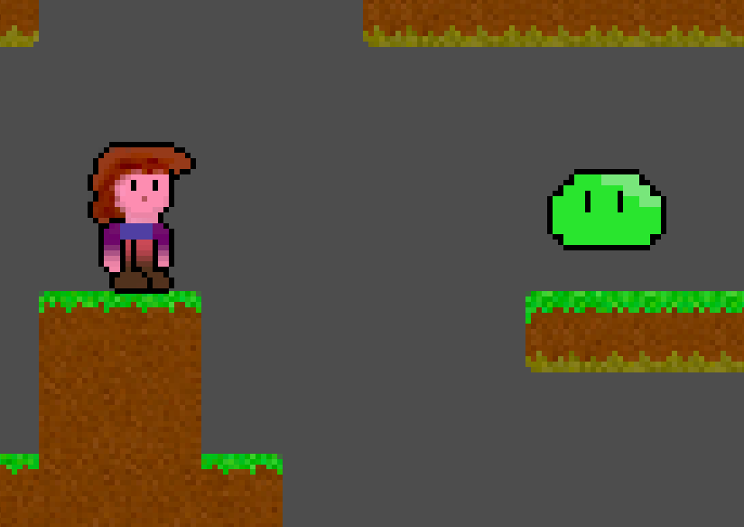
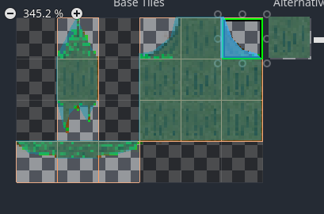

# Slimes, Breaking tiles, Falling Tiles, Scenery Tiles and Shaders

So for you it is day five, for me it's now day 14. :D

## Why so slow?

The reason is the research I did into Godot stuff you don't get out of the box:

- recipes that are stably invented for version 3, but need some translation to 4.1
- shading language concepts (last time I tried _that_ was back when GLSL was just released)
- which 'physics'-body to use for what and how (Rigid -> Static -> Rigid -> Character -> Area -> Static -> Rigid -> ooooh... I used the wrong method to apply the motion!)
- where's that polygon?! TileMap -> get_used_cells() -> TileData -> no ... TileMap -> get_used_cells() -> TileSetSource -> TileSet**Atlas**Source -> TileData -> get_collision_polygon_points() -> no?? ... yes! ... forgot to draw a polygon!

You're going to be spoiled with some 4.1 reïnvented recipes! (I hope)

## Any other excuses?

And the other reason is: my son wanted to write a 2.5D game last weekend: [Untitled Shoot 'em Up](https://github.com/Teaching-myself-Godot/untitled-shoot-em-up/tree/master)


## What we'll do today

1. [Make a bouncing Slime monster](#make-a-bouncing-slime-monster)
2. [Add the tree-trunk terrain](#add-the-tree-trunk-terrain)
3. [Make tiles Zelia can break](#make-tiles-zelia-can-break)
4. [Allow those breakable tiles to fall down](#allow-those-breakable-tiles-to-fall-down)
5. [Reuse tiles as background scenery](#reuse-tiles-as-background-scenery)
6. [Review my failed attempt to replace my TextureRenditions singleton with shaders](#review-my-failed-attempt-to-replace-my-texturerenditions-singleton-with-shaders)


# Make a bouncing Slime monster

Every game needs one.

## Setting up the slime scene

1. Download the zip: [assets/green-slime.zip](https://github.com/Teaching-myself-Godot/rewriting-zelia-tutorial/raw/main/assets/green-slime.zip)
2. Create the resource dirs `res://monsters/slime/green`
3. Extract the .png files in that `res://monsters/slime/green` dir 
4. Create a new `CharacterBody2D`-scene
5. Rename it to `Slime`
6. And save it into `res://monsters/slime/slime.tscn`
7. Give slime a child node `AnimatedSprite2D`
8. Navigate to its `Inspector Sprite Frames > SpriteFrame > Animations`
9. Change `default` into `airborne`, add `slime/green/5.png` to it
10. Add `floor_bounce` and add `1.png` - `4.png` to that -> in that order
11. Set `floor_bounce` to `7 fps` for the nicest effect:


### Add `2` collision shapes

Because our slime looks a little different depending on what state it's in, let's give it 2 collision shapes:

1. Add a child `CollisionShape2D`-node to `Scene > Slime` 
2. Name it: `AirborneCollisionShape`
3. Pick `CircleShape2D` under `Inspector > Shape`
4. Align it nicely around the `airborne` animation sprite:


Next:
1. Add another child `CollisionShape2D`-node to `Scene > Slime` 
2. Name it: `FloorBounceCollisionShape`
3. Pick `CapsuleShape2D` under  `Inspector > Shape`
4. Align it around the first `floor_bounce` animation sprite:


## Setting up the `slime.gd` script

Add the slime to the main scene:

1. Open `res://world.tscn`
2. Drag at least one slime scene `res://monsters/slimes/slime.tscn` into the `World`-scene
3. Test the main scene `World` with `F5` and observe that the slime hangs there doing nothing:



4. Open the `res://monsters/slimes/slime.tscn` scene
5. Attach a script to it, picking the default values in the dialog
6. You might notice a lot of suggested code for a `CharacterBody2D` - although it could be fun to try it out, it's not what we're looking for.
7. Remove all code and replace the `_physics_process` function body with `pass`:

```gdscript
extends CharacterBody2D


func _physics_process(delta):
	pass
```

### Adding the `MovementState`s

We have 2 animations currently, so let's create 2 movement states to match:
```gdscript
extends CharacterBody2D

enum MovementState { AIRBORNE, FLOOR_BOUNCE }

var movement_state : int

func _ready():
    # assume it starts out hanging in the air
    movement_state = MovementState.AIRBORNE

    # start up the correct animated sprite sprite frames for that state
	$AnimatedSprite2D.animation = "airborne"
	$AnimatedSprite2D.play()

```

We also know the slime must bounce around. We can use some familiar stuff for that:

```gdscript
# We want the level designer to be able to modify stuff like this.
@export var JUMP_VELOCITY = -400.0
var gravity = ProjectSettings.get_setting("physics/2d/default_gravity")
```

Now let's at the very least allow some `move_and_slide()` in the `_physics_process`, applying the gravity:
```gdscript
func _physics_process(delta):
	velocity.y += gravity * delta
    move_and_slide()
```
Now test again ith `F5` - the slime falls down and lands on the tiles.

### Picking the right collision shape

As we saw when we were setting up the scene, the slime has 2 `CollisionShapes2D`s attached of which only one should be active at a time, base on its `movement_state`.

Create a func `pick_collision_shape_for_movement_state`:
```gdscript
# enable the collision shape that matches the current movement state
func pick_collision_shape_for_movement_state():
	match (movement_state):
		MovementState.AIRBORNE:
			$AirborneCollisionShape.disabled = false
			$FloorBounceCollisionShape.disabled = true
		MovementState.FLOOR_BOUNCE:
			$AirborneCollisionShape.disabled = true
			$FloorBounceCollisionShape.disabled = false
```

And make sure to invoke it once the slime is instantiated:
```gdscript
func _ready():
	# assume it starts out hanging in the air
	movement_state = MovementState.AIRBORNE
	
	# enable the collision shape that matches the movement state
	pick_collision_shape_for_movement_state()
```

### Setting the right movement state in the `_physics_process`

When we programmed the player (hacked it together the 1st time) we had to do a lot of refactor work early on to make the `player.gd` code more understandable and maintainable.

The most important step we took was to separate out two stages in the `_physics_process` to determine what the player should do in this _iteration_ (this time around in the infinite loop):
1. `set_movement_state()`
2. `handle_movement_state()`

Even though it felt artificial to force such a hard separation in 2 functions, it made some code that is easier for a human (like us, I hope) to reason about.

Let's reapply it here, so first create the 2 new empty functions `set_movement_state` and `handle_movement_state` and invoke them from `_physics_process`, right after the gravity is applied:

```gdscript
func _physics_process(delta):
	# Apply gravity
	velocity.y += gravity * delta
	# Set, and handle movement state 
	set_movement_state()
	handle_movement_state()

	move_and_slide()
```

## Programming the full slime behaviour in steps

Now we will reason our way to a working, bouncing slime. Coding it in small steps:

1. [Make the slime bounce up and down](#make-the-slime-bounce-up-and-down)
2. [Make the slime bounce in the direction of the player](#make-the-slime-bounce-in-the-direction-of-the-player)
3. [Make the slime take damage from fireballs](#make-the-slime-take-damage-from-fireballs)
4. [Allow the slime to die from damage](#allow-the-slime-to-die-from-damage)
5. [Make the slime hurt the player by bouncing into the player](#make-the-slime-hurt-the-player-by-bouncing-into-the-player)

### Make the slime bounce up and down

Let's start out by making it land nicely. So we set the correct movement state and animated sprite when the slime is on the floor:
```gdscript
func set_movement_state():
	if is_on_floor():
		movement_state = MovementState.FLOOR_BOUNCE
		pick_collision_shape_for_movement_state()
		$AnimatedSprite2D.animation = "floor_bounce"
```

Test using `F5`.

The next step is to make it bounce up again round about when the `"floor_bounce"` animation finishes. We'll need a one-shot timer for that and we need to start it at the right moment:

1. Go to `Scene > Slime` and add a child node `Timer`
2. Rename it to `FloorBounceTimer`
3. Make sure `One Shot` is check to `On` under `Inspector`
4. Set its `Wait Time` to `0.571s`

"Why `0.571s`," you say? Well, it's 7fps times 4 animation frames: 
`1 / 7 * 4`.

5. Go to `Node > Timer` and double-click `timeout()`
6. Keep the defaults and attach it to the `Slime`'s script
7. So this is the moment we want the slime to jump up again, let's write:

```gdscript
func start_jump():
	velocity.y = JUMP_VELOCITY

func _on_floor_bounce_timer_timeout():
	start_jump()
```

8. We also need to start the timer when we know the slime has landed:
```gdscript
func set_movement_state():
	if is_on_floor():
        # place this new code _before_ changing the movement_state!
        # so only start the timer at the moment of _landing_
		if movement_state == MovementState.AIRBORNE:
			$FloorBounceTimer.start()
		movement_state = MovementState.FLOOR_BOUNCE
		pick_collision_shape_for_movement_state()
		$AnimatedSprite2D.animation = "floor_bounce"
```

Test with `F5`: it only flies up once and it looks off.

We're still missing something! We need to set the correct movement state, animation and collision shape for when `is_on_floor()` is `false`:

```gdscript
func set_movement_state():
	if is_on_floor():
        # ... leave the same ...
	else:
		movement_state = MovementState.AIRBORNE
		pick_collision_shape_for_movement_state()
		$AnimatedSprite2D.animation = "airborne"
```

Test with `F5`: that looks a _lot_ better

[](https://raw.githubusercontent.com/Teaching-myself-Godot/rewriting-zelia-tutorial/main/screenshots/bounce-anim.mp4)

#### Refactor early.

The code is cluttering up already. Also, we have not made use of our somewhat artificial separation between `set_movement_state` and `handle_movement_state` yet. 

That separation was supposed to make the code easier to reason about, So now apply the following early '_incisions_' >:)

Move the code that is more about _handling_ the current `movement_state` to the function `handle_movement_state`:

```gdscript
func handle_movement_state():
	pick_collision_shape_for_movement_state()
	# pick the animation sprite for the current movement state
	match(movement_state):
		MovementState.FLOOR_BOUNCE:
			$AnimatedSprite2D.animation = "floor_bounce"
		MovementState.AIRBORNE:
			$AnimatedSprite2D.animation = "airborne"
```

Now you can remove a lot of code from `set_movement_state`, leaving only the stuff that is more about _setting_ a new `movement_state`:

```gdscript
func set_movement_state():
	if is_on_floor():
		if movement_state == MovementState.AIRBORNE:
			$FloorBounceTimer.start()
		movement_state = MovementState.FLOOR_BOUNCE
	else:
		movement_state = MovementState.AIRBORNE
```

We still have a `match`-block that needs a comment to explain what it does. 

Let's fix that by creating a function for it:
```gdscript
func pick_sprite_for_movement_state():
	match(movement_state):
		MovementState.FLOOR_BOUNCE:
			$AnimatedSprite2D.animation = "floor_bounce"
		MovementState.AIRBORNE:
			$AnimatedSprite2D.animation = "airborne"
```

And invoke it from `handle_movement_state` like so:
```gdscript
func handle_movement_state():
	pick_collision_shape_for_movement_state()
	pick_sprite_for_movement_state()
```

Did you notice we applied the lesson we learned on day 3 about [refactoring big functions](day-3.md#extract-some-functions-for-less-messy-code)?

### Make the slime bounce in the direction of the player

So, now that the slimes are bouncing up and down nicely, we need to make them aware of where their only enemy is: _you_, the player.

So we already learned a surefire approach through using singletons (or `Autoload`) on [day 4](day-4.md#generate-renditions-to-make-the-fireball-dissipate). Let's apply that again:

1. Go to `Project > Project Settings... > Autoload`
2. Fill in `PlayerState` under `Node Name` and click `Add`
3. In the dialog keep the defaults and create the new file
4. Open `res://player_state.gd`
5. Add a `var position` of type `Vector2`
6. When `_ready` initialize it with `Vector2.ZERO`:

```gdscript
extends Node

var position : Vector2

func _ready():
	position = Vector2.ZERO
```

#### Updating `PlayerState.position`

Now this new `PlayerState` singleton must be updated at least every time the player moves. Do this by adding this one line to a suitable function in `player.gd`:

```gdscript
func _process(_delta)
	PlayerState.position = position
```

#### Using `PlayerState.position` in `slime.gd`

Now the slime can't fly, so the only property we need to update in `slime.gd` is the x-position.

The effect we want to achieve is that the slime only moves on the x-axis when airborne. That makes sense because slimes are sticky and do not slide around while stuck to the floor.

So the moment that we want to decide its `velocity.x` is when its jump starts and the moment that we want to stop x movement is when it lands. Go script it:
```gdscript
@export var X_VELOCITY = 100

func start_jump():
	velocity.y = JUMP_VELOCITY
	if PlayerState.position.x < position.x:
		velocity.x = -X_VELOCITY
	else:
		velocity.x = X_VELOCITY

func set_movement_state():
	if is_on_floor():
		if movement_state == MovementState.AIRBORNE:
			# new line:
			velocity.x = 0
			$FloorBounceTimer.start()
		movement_state = MovementState.FLOOR_BOUNCE
	else:
		movement_state = MovementState.AIRBORNE

```

Now press `F5` and test:

[](https://raw.githubusercontent.com/Teaching-myself-Godot/rewriting-zelia-tutorial/main/screenshots/slime-film2.mp4)


The first jump looks great, but the second jump already has an issue.

So apparently, when the slime hits a wall, the `velocity.x` is set to zero by `move_and_slide()`... Sounds like it makes perfect sense.

But we want it to fly left to reach te player, so we're going to _fight_ this resistance! :D. We'll pick our battle with physics right here:

```gdscript
func handle_movement_state():
	# keep trying to reach the player, even when bumping against the wall
	if is_on_wall():
		if PlayerState.position.x < position.x:
			velocity.x = -X_VELOCITY
		else:
			velocity.x = X_VELOCITY

	pick_collision_shape_for_movement_state()
	pick_sprite_for_movement_state()
```

#### Refactor early part 2

So I'm often a lone programmer, which is _bad_. One rule of thumb I learned concerning the DRY (Don't Repeat Yourself) principle I learned - when I _did_ work in a team - is: if you see the same snippet of code duplicated 3 times, refactor.

Well, I'm annoyed seeing it just _2_ times right now, so let's fix it _early_:
```gdscript
func follow_player():
	if PlayerState.position.x < position.x:
		velocity.x = -X_VELOCITY
	else:
		velocity.x = X_VELOCITY
```

Invoke it in `handle_movement_state` and `start_jump.`. Now your code is _`DRY`_ again.

### Make the slime take damage from fireballs

When a fireball hits a slime we can detect it, but which of the two should detect the collision?

Turns out we'll be handling this one, reasoning from the fireball. Which makes sense. The fireball will know how much punch it packs and it will deal it to anything that can `take_damage(...)`.

So the first thing we _will_ do is implement that method for the slime:

```gdscript
@export var hp = 10

func take_damage(dmg: int):
	hp -= dmg
	# test if it works
	print("Ouch! hp = " + str(hp))
```

Now add the collision detection to the fireball like this:
1. Open `res://projectiles/fireball/fireball.tscn`
2. Select `Scene > Fireball`
3. Go to `Node` next to the `Inspector` tab
4. Double click `Signals > Area2D > area_entered(...)`
5. And connect it to the _existing_ Fireball method `_on_body_entered`

**NOTE!** that this is the first time I'm not saying "pick the defaults in the dialog"

So first use `pick`:

And then choose the `_on_body_entered` method:


6. Adapt `func _on_body_entered` like so:

```gdscript
@export var damage = 1

func _on_body_entered(body):
	# if the body _can_ take damage, give it _my_damage
	if body.has_method("take_damage"):
		body.take_damage(damage)

	# ... leave the rest ...
```

So the var named `body` can be a slime and a slime will have the method `take_damage`. If it does, we invoke it! If not, it's not _'damageable'_.


**Programmer's rant**

We call this duck-typing: 
_"If it looks like a duck and quacks like a duck..."_: if the target has a `quack()` method, we assume proactively it's a duck.

In typed languages you need to _declare_ an interface which _tells_ the compiler (or interpreter) what methods the class implements. For a loosely typed scripting language like `gdscript` duck-typing makes more sense -- although inevitably you run into the request for type hints, like python did... anyway... whatever... you just want to make cool games, right? 

...and if they crash, just ask a programmer!

**/Programmer's rant**

Test with `F5`! 

All sorts of stuff is not working as expected!

1. [Fireballs just mysteriously start dissipating](#fireballs-collide-into-eachother-now--and-dissipate)
2. [Slimes are still not collided with by fireballs!](#issue-2-slimes-are-not-in-the-correct-collission-layermask)

So let's tackle both issues in reverse order :)

#### Issue #2: Slimes are not in the correct collission layer/mask

We forgot the collision layer and collision mask:

1. Open `res://monsters/slime/slime.tscn`
2. Go to `Inspector > Collision`
3. Add the number 2 to the collision mask and -layer:


That should fix it. The fireball should now dissipate upon hitting the slime and the slime should report its damage to the log:


#### Fireballs collide into eachother now .. and dissipate

So that mystery was solved quite quickly. Let's make sure that fireballs do _not_ beat eachother anymore by deselecting collision layer `2`:

1. Open `res://projectiles/fireball/fireball.tscn`
2. Go to `Inspector > Collision`
3. Deselect `Layer > 2`:


That should fix it:

[](https://raw.githubusercontent.com/Teaching-myself-Godot/rewriting-zelia-tutorial/main/screenshots/slime-film3.mp4)


### Allow the slime to die from damage

The next step is not to allow that strange bit of negative `hp`! 

All it takes is doing stuff we already did with the fireball: [autoloaded texture renditions](day-4.md#generate-renditions-to-make-the-fireball-dissipate)

1. Open `res://texture_renditions.gd`
2. Add the properties `slime` and `slime_dissipate`

```gdscript
var slime = preload("res://monsters/slime/green/5.png").get_image()
var slime_dissipate : Array = []
```

3. And use `get_dissipate_renditions` to generate renditions for slime-death

```gdscript
func _ready():
	slime_dissipate = get_dissipate_renditions(slime, 10, 2, 0.9)
	fireball_dissipate = get_dissipate_renditions(fireball, 15, 1, 0.5)
```

#### Add a `MovementState` and animation for slime death

Next open the slime script to add the renditions.

1. Open `res://projectiles/fireball/fireball.gd`
2. Copy the rendition load code to your paste-buffer (`Ctrl + C`)

```gdscript
	# The sprite_frames of $AnimatedSprite2D is a singleton, so after calling 
	# add_animation one time, it exists for all other instances
	if "dissipate" not in $AnimatedSprite2D.sprite_frames.get_animation_names():
		# Add a new animation to the SpriteFrames instance of the $AnimatedSprite2D node
		$AnimatedSprite2D.sprite_frames.add_animation("dissipate")
		# Loop through all rendition images in the global singleton fireball_dissipate
		for rendition in TextureRenditions.fireball_dissipate:
			# Add them as a frame to 
			$AnimatedSprite2D.sprite_frames.add_frame("dissipate", rendition)
```

3. Now open `res://monsters/slime/slime.gd`
4. And paste the copied code into the `_ready()` function, adjusting one bit: `.fireball_dissipate` becomes `.slime_dissipate`
```gdscript
	if "dissipate" not in $AnimatedSprite2D.sprite_frames.get_animation_names():
		# Add a new animation to the SpriteFrames instance of the $AnimatedSprite2D node
		$AnimatedSprite2D.sprite_frames.add_animation("dissipate")
		# Loop through all rendition images in the global singleton 
		for rendition in TextureRenditions.slime_dissipate:
			# Add them as a frame to 
			$AnimatedSprite2D.sprite_frames.add_frame("dissipate", rendition)
```

5. When the slime's `hp` is `<= 0` then it should _die_
6. Add the `MovementState.DYING` to the enum:
```gdscript
enum MovementState { AIRBORNE, FLOOR_BOUNCE, DYING }
```
7. So when the slime takes damage and drops below zero, set it:
```gdscript
func take_damage(dmg: int):
	hp -= dmg
	if hp <= 0:
		movement_state = MovementState.DYING
```
8. Make sure it is not _reset_ in `set_movement_state()` and disable collisions:
```gdscript
func set_movement_state():
	if movement_state == MovementState.DYING:
		# FIXME: move to pick_collision_shape_for_movement_state
		$AirborneCollisionShape.disabled = true
		$FloorBounceCollisionShape.disabled = true
	elif is_on_floor():
		if movement_state == MovementState.AIRBORNE:
			velocity.x = 0
			$FloorBounceTimer.start()
		movement_state = MovementState.FLOOR_BOUNCE
	else:
		movement_state = MovementState.AIRBORNE
```
8. And _handle_ it in the `movement_state` handler:
```gdscript
func handle_movement_state():
	if movement_state == MovementState.DYING:
		velocity = Vector2(0, 0)
	# the rest was there already (behind 'el')
	elif is_on_wall():
		follow_player()

	pick_collision_shape_for_movement_state()
	pick_sprite_for_movement_state()
```
9. And make sure the correct animation for dying is picked:
```gdscript
func pick_sprite_for_movement_state():
	match(movement_state):
		MovementState.FLOOR_BOUNCE:
			$AnimatedSprite2D.animation = "floor_bounce"
		MovementState.AIRBORNE:
			$AnimatedSprite2D.animation = "airborne"
		MovementState.DYING:
			$AnimatedSprite2D.animation = "dissipate"
```

#### The dissipate timer

1. Now let's add a `DissipateTimer` to the `Slime` scene
2. Open `res://monsters/slime/slime.tscn`
3. Go to `Scene > Slime` and add a child node `Timer`
4. And rename it to `DissipateTimer`
5. Make sure it is set to `One Shot` under `Inspector`, leave `Wait Time` to `1s` 
6. Connect its `timeout()`-signal to `slime.gd` in the usual way (defaults in dialog and such)
7. Implement as follows:
```gdscript
func _on_dissipate_timer_timeout():
	queue_free()
```
8. And of course let's not forget to fire the timer when the slime has no hp left:
```gdscript
func take_damage(dmg: int):
	hp -= dmg
	if hp <= 0:
		movement_state = MovementState.DYING
		$DissipateTimer.start()
```

Test again and make sure the slime does stay dead...


### Make the slime hurt the player by bouncing into the player

Being a `CharacterBody2D`, same as the `Player` is, the `Slime` does not have the `body_entered`, nor does it have `area_entered` out of the box. 

It is probably easier to just code collisions with the player more traditionally: in its movement handler using its `get_slide_collision_*` methods like documented in
[Detecting collisions](https://docs.godotengine.org/en/stable/tutorials/physics/using_character_body_2d.html#detecting-collisions):

1. Open `slime.gd`
2. Add a default damage as public property:
```gdscript
@export var damage = 1
```
3. Write a function `damage_player`:
```gdscript
func damage_player():
	# detect collisions based on collision count
	for i in get_slide_collision_count():
		# get current colliding other thing
		var collider = get_slide_collision(i).get_collider()
		# test if other thing is the Player
		# (collider could be null, so test existence first)
		if collider and collider.name == "Player":
			# make the player take damage
			collider.take_damage(damage)
```

Testing with `F5` we soon run into an issue: the player does not yet have the `take_damage` method.

4. Open `player.gd`
5. Write the method `take_damage`:
```gdscript
func take_damage(damage : float):
	print("Ouch! I took: " + str(damage) + " damage!")
```

Test with `F5` again and notice: she's taking a _lot_ of damage:
```
Ouch! I took: 1 damage!
Ouch! I took: 1 damage!
Ouch! I took: 1 damage!
Ouch! I took: 1 damage!
Ouch! I took: 1 damage!
Ouch! I took: 1 damage!
Ouch! I took: 1 damage!
Ouch! I took: 1 damage!
Ouch! I took: 1 damage!
Ouch! I took: 1 damage!
Ouch! I took: 1 damage!
Ouch! I took: 1 damage!
```

So let's leave our player immortal for a while longer, because tweaking how fast she should die is pretty hard. 

We want to move on to bigger and better things for now.

Just take a _pass_ on her `take_damage` function for now so we don't clog up the log:
```gdscript
func take_damage(_damage):
	# leave Zelia immortal for a while longer
	pass
```

#### Just one more tweak: bounce off of the player

One thing we should do now to finish the `Slime` behaviour is to allow it to bounce off of the player a little with the extra benefit that it won't collide into her _that_ often.

We can reuse its `start_jump` method for that:
```gdscript
		# test if other thing is the Player
		if collider.name == "Player":
			# make the player take damage
			collider.take_damage(damage)
			# this is new
			start_jump()
```

Testing again shows one more error: the slime double jumps! You can fix it by killing the `FlourBounceTimer` when a jump is started:

```gdscript
func start_jump():
	$FloorBounceTimer.stop()
	velocity.y = JUMP_VELOCITY
	follow_player()
```

That's a little much, maybe the slime should bounce off a bit less high:
```gdscript
func start_jump(init_velocity = JUMP_VELOCITY):
	$FloorBounceTimer.stop()
	velocity.y = init_velocity
	follow_player()
```

Now in `damage_player` we can invoke it with a different init_velocity like:  `start_jump(-150)`, still taking `JUMP_VELOCITY` as its default value.


# Add the `tree-trunk` terrain

Because Zelia (in the original game) runs into tiles that are not just squares, our rewrite must have them as well. Open `res://world.tscn`.

1. Create a new Terrain in `World > Inspector > Terrain Sets > Terrains`: "Tree Trunk"
2. Add the `res://surface_maps/tree-trunk/1.png` to our existing `TileSet` - like we learned on [day 2](day-2.md#making-an-atlas-of-an-image).
3. Be sure to assign Terrain `1` this time, under the `Select` step
4. When you get to the step for `Physics` with the `F`-hotkey we're going to do something new, but first...
5. Don't forget to also create the 1 alternative tile (in case you want to handle all the drag-and-draw painting)

### Create polygons

So textures in these tiles are not square at all! It would look pretty silly for Zelia to bump into free air. You can easily fix this by manipulating the `physics`-rect to become a polygon. 

Under `Select > Physics > Physics Layer 0` there is an image with that rect drawn over it. Just click on the edges to add a new draggable vertex and manipulate that rect until it looks right:


Next finish up the rest of the tree-trunk tiles until it looks like this:




### Don't forget to draw the the `Terrains Peering Bit` for each tile using the `Tree Trunk` terrain from `Terrain Set 0`

So that bit should look like this:


## Draw and test!

Can Zelia now run up a slope? Why not try it out yourself..

Anyway, the place to test it out is in `res://world.tscn` and drawing this new terrain into the scene like we learned on [day 2](day-2.md#paint-some-terrain):


## Solve Technical debt 3

Now we want to achieve these next steps:
1. breakable tiles
2. tiles that fall down
3. tiles we can use as background scenery

However, currently we only have one scene containing our `TileMap` and that scene _is_ the `TileMap`. Which we renamed to `World`.

That is a _tight coupling_ between a `TileMap` and the entire rest of the game we foresaw  [technical debt on day 2](day-2.md#technical-debt-3).

What we _need_ is that the main scene of our game has _instances_ of our `TileMap`-scene:

1. Create a new scene called `Game` that extends `Node`
2. Save it into `res://game.tscn`
3. Rename `res://world.tscn` to `res://terrains.tscn`
4. Rename the scene name `World` to `Terrains`
5. Delete all `Terrains`' child nodes (`Player`, `Fireball` - if still present, `Slime`s)
6. Detach the `world.gd`-script by right clicking on the `Terrains`-node:


7. Rename `res://world.gd` to `res://game.gd`
8. Now open the `game.tscn` again and attach the `game.gd` script to it
9. Make sure the script now extends `Node` in stead of `TileMap`:

```gdscript
extends Node

func _on_player_cast_projectile(spell_class, direction, origin):
	var spell = spell_class.instantiate()
	add_child(spell)
	spell.rotation = direction
	spell.position = origin
	spell.velocity = Vector2.from_angle(direction) * 150.0
```

10. Attach the following scenes as children for `Game` by dragging them from the `FileSystem` tab:
- `res://terrains.tscn`
- `res://player/player.tscn`
- `res://monsters/slime/slime.tscn`

11. Make `res://game.tscn` the main scene by right clicking it in the `FileSystem` tab
12. Check the scene, which in my case looked like this:


There is one thing: Zelia can't shoot anymore.

### Fix the fireballs

So we need to connect the `cast_projectile`-signal again to `_on_player_cast_projectile` (moved to `game.gd`), like we did on [day 4](day-4.md#declare-and-invoke-a-signal-to-cast-spells):

1. Select the `Player`-node (the _child_ node of `Game`)
2. Go to `Node > Signals`
3. Double click `cast_projectile`
4. Select `pick`
5. Double click on `_on_player_cast_projectile(...)`
6. Click `connect`

Test the game with `F5`


# Make tiles Zelia can break

This next bit took quite some research and avenues attempted yet not taken.

It might seem like the steps are evident and told as if they're easy (or even might have been done much better). They are, however, like many things, the result of effort, trial and error.

That's why you just get the steps without the philosophies. 

## The final approach in very simplified terms

1. Say a `Terrains`-instance is `breakable` using `Metadata`
2. When the `Terrains`-instance is `_ready()` check if this `breakable`-field is `true`.
3. If yes, loop through all the tiles in this instance
4. For each tile, signal an event `add_breakable_tile`
5. Let the `game.gd` script handle this signal ..
6.  .. by creating instances of a new scene called `BreakableTile`
7. After the loop is done, invoke `queue_free()` to clear this `Terrains`-instance

But first: preparations!

## Erase the tiles in the `Terrains`-scene

First let's erase the tiles in the `Terrains`-scene.

1. Open `res://terrains.tscn`.
2. Click the `Scene > Terrains`-node
3. Select `TileMap` in the bottom pane


4. Select the `Terrains`-tab


5. Pick on of the Terrains
6. Select the eraser to erase the tiles


7. Open `res://game.tscn`


8. Now click the _child_ node `Terrains`
9. Navigate to `TileMap > Terrains` in the bottom pane again
10. And draw some terrain in the `Terrains`-_instance_ of the `Game`-scene

## Adding a new `Terrain`-instance to `Game`

Now, without too many philosophies (as promised), thus further ado:

1. Drag _another_ instance of `res://terrains.tscn` _into_ the `Game` scene
2. It will be called `Terrains2` if you did that right
3. Rename it to `BreakableTerrains`
4. Draw one tile while `BreakableTerrains` is active.


5. Test if it is indeed in a the separate node by toggling its visibility:


## Adding `Metadata` fields 

Now that we have a new _instance_ of terrain in the game, we need to transmogrify it into breakable terrain. That means _telling our code_ we intend to do that using _metadata_.

1. Open `res://terrains.tscn`
2. Navigate to the `Inspector`
3. Scroll all the way down to find the `+ Add Metadata`-button
4. Click that button
5. In the dialog give it the name `breakable`
6. Keep the type as `bool`
7. Click `Add`:


8. Don't forget to save!
8. Open `res://game.tscn`
9. Click on `BreakableTerrains`
10. Pop open the `Inspector > Metadata`
11. And _here_ check `On` the `Breakable` field:


12. Also notice the revert arrow, which implies we overrode default behaviour

## Attach a new `terrains.gd` script

1. Open `res://terrains.tscn`
2. Click the -button
3. Leave defaults active and click `Create`
4. First let's check if our new `Metadata`-field works:
```gdscript
extends TileMap

func _ready():
	if get_meta("breakable"):
		print (name + " is breakable")
```
5. Test with `F5` and observe:
```
BreakableTerrains is breakable
```
### A thorough guide to the _poor man's debugger_

Now we will loop through the tiles and read _all_ the properties we'll need to signal the game to create that `BreakableTile`-instance [we announced before](#the-final-approach-in-very-simplified-terms). 

All the godot methods and properties used are linked to their respective class-references:

1. Loop through the tiles in our current (only) layer using [get_used_cells](https://docs.godotengine.org/en/stable/classes/class_tilemap.html#class-tilemap-method-get-used-cells)
```gdscript
func _ready():
	if get_meta("breakable"):
		print (name + " is breakable")
		# Loop through the tile positions in our current (only) layer
		for cell in get_used_cells(0):
			print(cell)
			print(cell * tile_set.tile_size)
```
2. Observe the log:
```
BreakableTerrains is breakable
(7, 2)
(105, 30)
```
The `(7, 2)` is the string serialization of a `Vector2i`, which represents the position of this tile on the `TileMap`'s grid. 

Our [`tile_set`](https://docs.godotengine.org/en/stable/classes/class_tilemap.html#class-tilemap-property-tile-set).[tile_size](https://docs.godotengine.org/en/stable/classes/class_tileset.html#class-tileset-property-tile-size) is `15x15` so the `position` of the `BreakableTile` will become `(105, 30)` _plus_ the `position` of this `TileMap` instance.

3. Let's just print that `TileMap`-instance's `position` just to check:
```gdscript
extends TileMap

func _ready():
	if get_meta("breakable"):
		print (name + " is breakable")
		print (name + "'s origin is: " + str(position))
		# Loop through the tile positions in our current (only) layer
		for cell in get_used_cells(0):
			print("Tile grid position:            " + str(cell))
			print("BreakableTile target position: " + str(Vector2i(position) + cell * tile_set.tile_size))
```
4. Run with `F5` and inspect the log:
```
BreakableTerrains is breakable
BreakableTerrains's origin is: (0, 0)
Tile grid position:            (7, 2)
BreakableTile target position: (105, 30)
```
5. Open `res://game.tscn` and select `BreakableTerrains`
6. Change its position in `Inspector > Transform > Position` 
7. Rerun the game and inspect the log again:
```
BreakableTile target position: (115, 41)
```
8. Changed the `BreakableTerrains`' position by `+(10,11)` as can be observed in the log
9. Quickly revert the `position` to `(0, 0)`, which makes reasoning easier.
10. Next use [`get_cell_source_id`](https://docs.godotengine.org/en/stable/classes/class_tilemap.html#class-tilemap-method-get-cell-source-id) and [`tile_set`](https://docs.godotengine.org/en/stable/classes/class_tilemap.html#class-tilemap-property-tile-set).[`get_source`](https://docs.godotengine.org/en/stable/classes/class_tileset.html#class-tileset-method-get-source) to obtain the [`TileSetAtlasSource`](https://docs.godotengine.org/en/stable/classes/class_tilesetatlassource.html) we used for our textures and physics polygons:
```gdscript
		for cell in get_used_cells(0):
			print("Tile grid position:            " + str(cell))
			print("BreakableTile target position: " + str(Vector2i(position) + cell * tile_set.tile_size))
			var source_id = get_cell_source_id(0, cell)
			var tileset_source : TileSetAtlasSource = tile_set.get_source(source_id)
			print("TileSetAtlasSource:            " + tileset_source.resource_name)
```
11. Test with `F5` again:
```
BreakableTerrains is breakable
BreakableTerrains's origin is: (0, 0)
Tile grid position:            (7, 2)
BreakableTile target position: (105, 30)
TileSetAtlasSource:            grass-and-dirt
```
12. Next use our `cell` to obtain the position in the _atlas_ texture of the current tile using [`get_cell_atlas_coords`](https://docs.godotengine.org/en/stable/classes/class_tilemap.html#class-tilemap-method-get-cell-atlas-coords)

```gdscript
			var tile_atlas_coords = get_cell_atlas_coords(0, cell)
			print("tile_atlas_coords:             " + str(tile_atlas_coords))
```

13. And of course, this also should be multiplied by our `tile_set`.`tile_size` to get the pixel position on the underlying texture.
```gdscript
			print("tile_atlas_coords:             " + str(tile_atlas_coords * tile_set.tile_size))
```
14. In order to clip out the correct image we need the  `Texture2D`-resource of the _atlas_ as well
```gdscript
			print("texture:                       " + tileset_source.texture.resource_path)
```
15. Just to be sure we're still on the same page, check your debug log again:
```
BreakableTerrains is breakable
BreakableTerrains's origin is: (0, 0)
Tile grid position:            (7, 2)
BreakableTile target position: (105, 30)
TileSetAtlasSource:            grass-and-dirt
tile_atlas_coords:             (60, 15)
texture:                       res://surface_maps/grass-and-dirt/1.png
```

The last bit of information up next was the one that took me the longest: the collision polygons of this tile (_especially because I forgot to draw the polygon for the tile I was testing :D_).

_Also, the obstinate use of **obtain** umpten times is intentional_: it's an _achievement_.

16. Use the `tile_atlas_coords` we obtained with the `tileset_source` we obtained to obtain the [`tile_data`](https://docs.godotengine.org/en/stable/classes/class_tiledata.html#class-tiledata) of this tile with [`get_tile_data`](https://docs.godotengine.org/en/stable/classes/class_tilesetatlassource.html#class-tilesetatlassource-method-get-tile-data)
17. And then invoke [`get_collision_polygon_points`](https://docs.godotengine.org/en/stable/classes/class_tiledata.html#class-tiledata-method-get-collision-polygon-points) to obtain the ... wait for it ... `PackedVector2Array` representing the collision polygon of this tile:

```gdscript
			var tile_data = tileset_source.get_tile_data(tile_atlas_coords, 0)
			print("polygon:                       " + str(tile_data.get_collision_polygon_points(0, 0)))
```
18. And that should look like this in your debug log:
```
polygon:                       [(-7.5, -7.5), (7.5, -7.5), (7.5, 7.5), (-7.5, 7.5)]
```

Now, just to make sure we did everything correctly (_did you also notice the 5 magic zeroes `0` we introduced, representing layers and layers and more layers of which we only seem to have one at each turn?_).. Let plant a tree with a divergent polygon as well (in our `BreakableTerrains`-instance of course):


That should log something similar to this:
```
Tile grid position:            (9, 3)
BreakableTile target position: (135, 45)
TileSetAtlasSource:            tree-trunk
tile_atlas_coords:             (75, 0)
texture:                       res://surface_maps/tree-trunk/1.png
polygon:                       [(-7.5, -7.5), (-6.125, -7.5), (-3.25, 0.125), (0.5, 4.5), (5.625, 5.75), (7.5, 7.5), (-7.5, 7.5)]
```

## Declaring and emitting the `add_breakable_tile` signal

Now that we've collected all the information we need for the game to spawn in _one_ `BreakableTile` per tile in our `BreakableTerrains`-instance we're ready to us it.

1. Declare the signal `add_breakable_tile` as follows in `terrains.gd`:

```gdscript
signal add_breakable_tile(
	position     : Vector2i, 
	texture      : Texture2D, 
	texture_pos  : Vector2i,
	# collisigon is my personal shorthand for "collision polygon"
	collisigon   : PackedVector2Array
)
```
2. And `emit` it in the loop (_note we remove all the `print`s_):
```gdscript
func _ready():
	if get_meta("breakable"):
		# Loop through the tile positions in our current (only) layer
		for cell in get_used_cells(0):
			var source_id = get_cell_source_id(0, cell)
			var tileset_source : TileSetAtlasSource = tile_set.get_source(source_id)
			var tile_atlas_coords = get_cell_atlas_coords(0, cell)
			var tile_data = tileset_source.get_tile_data(tile_atlas_coords, 0)
			emit_signal(
				"add_breakable_tile",
				Vector2i(position) + cell * tile_set.tile_size,
				tileset_source.texture,
				tile_atlas_coords * tile_set.tile_size,
				tile_data.get_collision_polygon_points(0, 0)
			)
```
3. Now in `res://game.tscn` select `BreakableTerrains` again
4. Navigate to `Node > Signals`
5. Double click `add_breakable_tile`
6. Leave the defaults (so target is `game.gd`) and click `Connect`
7. Now print the inputs in this new listener:
```gdscript
func _on_breakable_terrains_add_breakable_tile(
	target_pos  : Vector2,
	texture     : Texture2D,
	texture_pos : Vector2i,
	collisigon  : PackedVector2Array
):
	print("Target position of BreakableTile:   " + str(target_pos))
	print("Atlas texture resource dir:         " + str(texture.resource_path))
	print("Position of this tile in the atlas: " + str(texture_pos))
	print("Collision polygon of this tile:     " + str(collisigon))
```
8. Go back to `res://terrains.gd`
9. Earlier [we announced](#the-final-approach-in-very-simplified-terms) in step 7 we would call `queue_free` after all the tiles in the map were _signalled_:
```gdscript
func _ready():
	if get_meta("breakable"):
		# Loop through the tile positions in our current (only) layer
		# ... leave the for-loop in tact of course ...
		# Remove this TileMap from the parent scene
		queue_free()
```

If you test again now, all we have left is the print messages in our console, but the (as yet) unbreakable tiles from the `BreakableTerrains`-`TileMap` are gone.

## Creating the `BreakableTile` scene

Now in order the `game.gd` to instantiate breakable tiles and attach then as children we first need to make a `BreakableTile`-scene.

It will be a bit of a weird scene, because we will be giving it empty child-nodes:
- An empty `Sprite2D` ..
- .. and an empty [`CollisionPolygon2D`](https://docs.godotengine.org/en/stable/classes/class_collisionpolygon2d.html)

1. Create a new scene of type [`StaticBody2D`](https://docs.godotengine.org/en/stable/classes/class_staticbody2d.html)
2. In the scene tree rename its root node to `BreakableTile`
3. Save the scene as `res://tiles/breakable_tile.tscn` 
4. Give it one child node of type `Sprite2D`
5. And another child node of type `CollisionPolygon2D`

It doesn't look like much in the - scene view, maybe _temporarily_ we _should_ add a texture for testing purposes:

1. Create `15x15 pixel` sized `.png` of any type you prefer (as long as it is _visible_!)
2. Save that file into `res://tiles/placeholder.png`
3. Select the `BreakableTile > Sprite2D` node
4. Go to `Inspector` and select  `Texture > new ImageTexture`
5. Drag the `placeholder.png` into the select-box


Now we can instantiate the scene with at the right position in the `game.gd` script:

1. Open `res://game.gd`
2. Use [`preload`](https://docs.godotengine.org/en/stable/tutorials/scripting/gdscript/static_typing.html#custom-variable-types) to import the `BreakableTile`-scene:

```gdscript
var BreakableTile = preload("res://tiles/breakable_tile.tscn")
```

3. Instatiate it in `_on_breakable_terrains_add_breakable_tile`
4. And then use the `position` argument to set its position property
```gdscript
func _on_breakable_terrains_add_breakable_tile(
	target_pos  : Vector2,
	texture     : Texture2D,
	texture_pos : Vector2i,
	collisigon  : PackedVector2Array
):
	var new_tile : StaticBody2D = BreakableTile.instantiate()
	new_tile.position = target_pos
```

This still does nothing visible. 

We need to add the `BreakableTile`-instance(s) to the game tree, which would make us see our `rest://tiles/placholder.png`-texture.

**HEADS UP!** This next snippet won't work:
```gdscript
func _on_breakable_terrains_add_breakable_tile(
	target_pos  : Vector2,
	texture     : Texture2D,
	texture_pos : Vector2i,
	collisigon  : PackedVector2Array
):
	var new_tile : StaticBody2D = BreakableTile.instantiate()
	new_tile.position = target_pos
	# this is the code we want to execute
	add_child(new_tile)
```
For the sake of learning, press `F5`.

So now we get this error in our console:
```
game.gd:16 @ _on_breakable_terrains_add_breakable_tile(): Parent node is busy setting up children, `add_child()` failed. Consider using `add_child.call_deferred(child)` instead.
```
That sounds super helpful! Let's try it out!
```gdscript
func _on_breakable_terrains_add_breakable_tile(
	target_pos  : Vector2,
	texture     : Texture2D,
	texture_pos : Vector2i,
	collisigon  : PackedVector2Array
):
	var new_tile : StaticBody2D = BreakableTile.instantiate()
	new_tile.position = target_pos
	add_child.call_deferred(new_tile)
```

Test again with `F5` and voilà, our pretty placeholder is added tot the scene:


### But wait, what's wrong with this picture? 

Exactly, the placement of our breakable tiles looks wrong, even though we correctly calculated their position. We need to fix the position of our `Sprite2D` and `CollisionPolygon2D` to match where the tile will be placed:

1. Open `res://tiles/breakable_tile.tscn` in -scene view
2. Select `BreakableTile > Sprite2D`
3. Then set `Inspector > Transform > Position` to `x=7.5` and `y=7.5`
4. Select `BreakableTile > CollisionPolygon2D` 
5. Also set `Inspector > Transform > Position` to `x=7.5` and `y=7.5`
6. It should now look like this:


**Lesson learned**: I'm not liking these `7.5`'s I'm starting to see everywhere... I should have gone for `16x16` last year when I started drawing stuff based on my easy maths.


### Setting the texture and collision polygon of the `BreakableTile`

The rest of the properties we prepared in `game.gd` we will pass on to properties for the `BreakableTile` itself to handle in its `_ready`-function.

1. Open `res://tiles/breakable_tile.tscn` 
2. Select the root node `BreakableTile`
3. Click the -button 
4. Leave the defaults and save into `res://tiles/breakable_tile.gd`
5. Add these public properties:
```gdscript
extends StaticBody2D

@export var texture     : Texture2D
@export var texture_pos : Vector2i
@export var collisigon  : PackedVector2Array

func _ready():
	print("BreakableTile.position:    " + str(position))
	print("BreakableTile.texture:     " + str(texture.resource_path))
	print("BreakableTile.texture_pos: " + str(texture_pos))
	print("BreakableTile.collisigon:  " + str(collisigon))

```
6. Open `res://game.gd`
7. Set these new public properties in our signal listener:
```gdscript
func _on_breakable_terrains_add_breakable_tile(
	target_pos  : Vector2,
	texture     : Texture2D,
	texture_pos : Vector2i,
	collisigon  : PackedVector2Array
):
	var new_tile = BreakableTile.instantiate()
	new_tile.position    = target_pos
	new_tile.texture     = texture
	new_tile.texture_pos = texture_pos
	new_tile.collisigon  = collisigon
	add_child.call_deferred(new_tile)
```

Test this code again with `F5` and confirm we're still seeing the same thing in our consoles:
```
BreakableTile.position:    (105, 30)
BreakableTile.texture:     res://surface_maps/grass-and-dirt/1.png
BreakableTile.texture_pos: (60, 15)
BreakableTile.collisigon:  [(-7.5, -7.5), (7.5, -7.5), (7.5, 7.5), (-7.5, 7.5)]
BreakableTile.position:    (135, 45)
BreakableTile.texture:     res://surface_maps/tree-trunk/1.png
BreakableTile.texture_pos: (75, 0)
BreakableTile.collisigon:  [(-7.5, -7.5), (-6.125, -7.5), (-3.25, 0.125), (0.5, 4.5), (5.625, 5.75), (7.5, 7.5), (-7.5, 7.5)]
```
8. Now let's set the correct texture, texture position and polygon in code:
```gdscript
func _ready():
	$Sprite2D.set_texture(texture)
	$Sprite2D.region_rect = Rect2(texture_pos.x, texture_pos.y, 15, 15)
	$CollisionPolygon2D.polygon = collisigon
```

Testing with `F5` you'll probably get this, like me (the entire atlas as a texture):


That is because you need to _enable_ the `region_rect` feature we used. You can either do this in code or in the `BreakableTile`-inspector. 
1. in code: `$Sprite2D.region_enabled = true`
2. in the scene select the `Sprite2D`-child node: check `Inspector > Region > Enabled` to `On`

It's really up to you which you choose, but this tutorial has used the _configuration over code_ approach so far, which implies the 2nd choice... (Usually, as a programmer, I prefer code as configuration, keeping everything nice and together, in stead of in separate places).

### Fix the collision layer and -mask

One last thing you'll have noticed by now is that the collision layer and -mask are not the same for our `BreakableTile` as for our `Terrains` scene. That explains fireballs flying right through them.

Let's make them match.

1. Open `res://tiles/breakable_tile.tscn`
2. Go to `Inspector > Collision`
3. For `Layer` check both `1` and `2`
4. And for `Mask` check both `1` and `2` as well

## Make them break!!

_Finally_!

Up till now we only made a copy of some tiles as a `StaticBody2D`, which made them behave the same as the `TileMap`.

However, now we can use fireball-collisions to reduce some `HP`-property and let the tiles disappear when they're out of `HP`.

Here we will use a 2-step approach:
1. [Give the breakable tiles an HP property, reduce it on 'take_damage', make them `queue_free`](#remove-tiles-that-are-broken)
2. [Generate _'cracked'_ renditions of the terrain textures to show the user the damage](#generate-some-pretty-cracks-to-show-the-tile-damage)

## Remove tiles that are broken

We made things that can take damage implement the `take_damage`-function. 

That way, things that _give_ damage have a place to _invoke_ that damage. Like our fireballs.

Let's see if we can achieve that effect right now
1. Open `res://tiles/breakable_tile.gd`
2. Implement `take_damage()` like this:
```gdscript
func take_damage(dmg : float):
	print("Breakable tile taking " + str(dmg) + " damage")
```

Then press `F5` and shoot some fireballs at it. Check the console if we're still seeing the same things:
```
Breakable tile taking 1 damage
Breakable tile taking 1 damage
Breakable tile taking 1 damage
```

Yup! That works. Now let's add a public property called `hp` which we can set from _metadata_ later.

3. Add the `hp` property on top of `breakable_tile.gd` and set it to `10` as a default.
```
extends StaticBody2D

@export var hp          : float = 10.0
@export var texture     : Texture2D
@export var texture_pos : Vector2i
@export var collisigon  : PackedVector2Array
```
4. Implement `take_damage` like this now:
```gdscript
func take_damage(dmg : float):
	hp -= dmg
	if hp <= 0:
		queue_free()
```

Then press `F5` and shoot some fireballs at it _again_. 

Watch with satisfaction as these tiles disappear after only `10` hits with a fireball:

[](./screenshots/break-a-tile.mp4)

### HP as metadata

As a level editor you want control over the amount `HP` a breakable tile gets. We can achieve this by adding another metadata field to our `Terrains`-`Tilemap` scene called.. `Hp`.

Let's do that now:

1. Open `res://terrains.tscn` and select the `Terrains` root node
2. Go to `Inspector > Metadata > + Add Metadata`
3. Set the `Name` to `hp` and the type to `float` or `int` (your _quacking_ choice)
4. Click `Add`
5. Set the value to `10` to serve as the default value
6. Now open `res://terrains.gd`
7. Add `hp` as a 5th parameter to `add_breakable_tile`

```gdscript
signal add_breakable_tile(
	position     : Vector2i, 
	texture      : Texture2D, 
	texture_pos  : Vector2i,
	collisigon   : PackedVector2Array,
	hp           : float
)
```
8. Add the `hp`-metadata to the `emit_signal`-call for each tile:
```gdscript
			emit_signal(
				"add_breakable_tile",
				Vector2i(position) + cell * tile_set.tile_size,
				tileset_source.texture,
				tile_atlas_coords * tile_set.tile_size,
				tile_data.get_collision_polygon_points(0, 0),
				get_meta("hp")
			)
```

9. Open `res://game.gd`
10. Add the `hp` to `_on_breakable_terrains_add_breakable_tile` and set it on the `BreakableTile` instance there:
```gdscript
func _on_breakable_terrains_add_breakable_tile(
	target_pos  : Vector2,
	texture     : Texture2D,
	texture_pos : Vector2i,
	collisigon  : PackedVector2Array,
	hp          : float
):
	var new_tile = BreakableTile.instantiate()
	new_tile.position    = target_pos
	new_tile.texture     = texture
	new_tile.texture_pos = texture_pos
	new_tile.collisigon  = collisigon
	new_tile.hp          = hp
	add_child.call_deferred(new_tile)
```

To test, see how it works when you change `hp` metadata in the `BreakableTerrains` tilemap of your game.

## Generate some pretty cracks to show the tile damage

What is missing is some visual feedback of tiles breaking. For that effect, we will revisit our approach to [renditions](./day-4.md#generate-renditions-to-make-the-fireball-dissipate), like we did with the [dissipating fireballs](./day-4.md#generate-renditions-to-make-the-fireball-dissipate).

This time we will use a set of `.png` files as an alpha mask. You can download them from here:

[Download cracked-renditions.zip](https://github.com/Teaching-myself-Godot/rewriting-zelia-tutorial/raw/main/assets/cracked-renditions.zip)

1. Extract `cracked-renditions.zip` in `res://surface_maps`
2. Open `res://texture_rendition.gd`

# Allow those breakable tiles to fall down

Rigid -> Static -> Rigid -> Character -> Area -> Static -> Rigid -> ooooh...

Spoiler: it was [StaticBody2D](https://docs.godotengine.org/en/stable/classes/class_staticbody2d.html#class-staticbody2d) I wanted all along.

# Reuse tiles as background scenery

My first [shader](https://docs.godotengine.org/en/stable/tutorials/shaders/your_first_shader/your_first_2d_shader.html) was not that fancy at all.

# Review my failed attempt to replace my TextureRenditions singleton with shaders

My [second shader](https://github.com/Teaching-myself-Godot/godot-zelia/blob/no-per-instance-shaders-for-canvas_items/dissipation_shader.gdshader) was pretty cool, but alas: all the fireballs scattered together.
